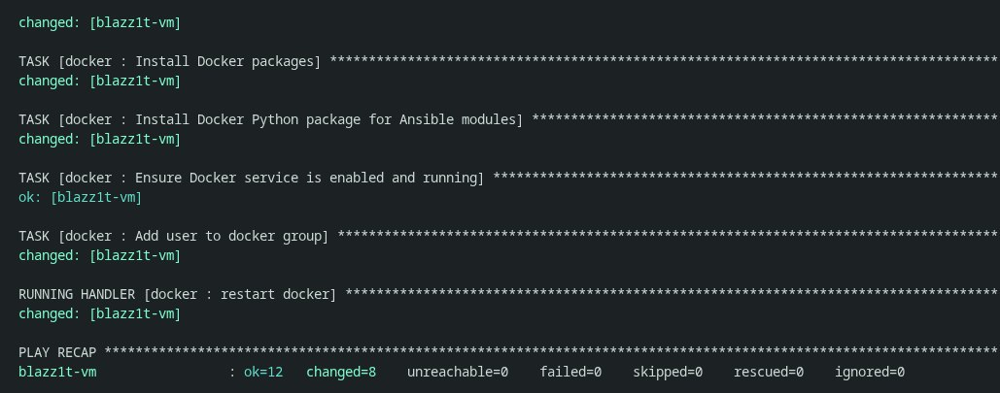
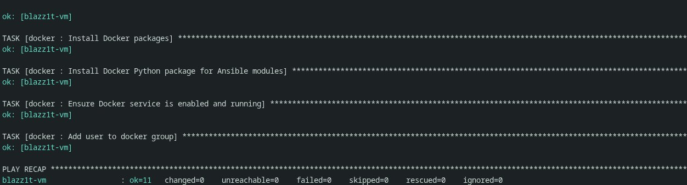
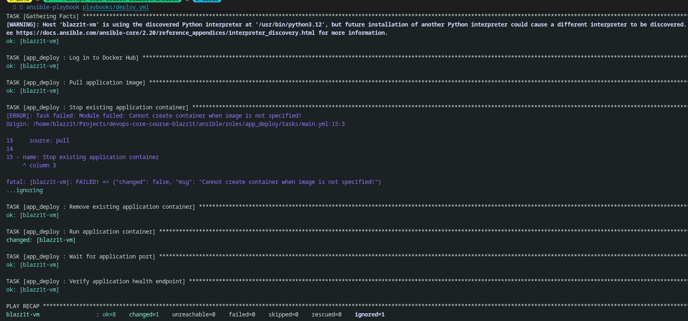
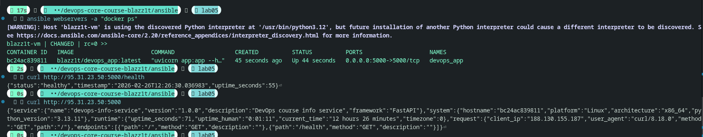

# LAB 05 — Ansible Fundamentals Documentation

## 1. Architecture Overview

- **Ansible version (control node):** `ansible [core 2.20.2]`
- **Target VM:** `blazz1t-vm` (`95.31.23.50`) from Lab 4
- **Target OS:** Ubuntu VM (Lab requirement: Ubuntu 22.04/24.04)
- **Execution model:** role-based playbooks (`provision.yml`, `deploy.yml`) with reusable roles in `roles/`

### Project Structure (implemented)

```text
ansible/
├── ansible.cfg
├── inventory/
│   ├── hosts.ini
│   └── group_vars/
│       └── all.yml            # vaulted secrets for inventory scope
├── group_vars/
│   └── all.yml                # vaulted secrets
├── playbooks/
│   ├── provision.yml
│   └── deploy.yml
├── roles/
│   ├── common/
│   │   ├── defaults/main.yml
│   │   └── tasks/main.yml
│   ├── docker/
│   │   ├── defaults/main.yml
│   │   ├── tasks/main.yml
│   │   └── handlers/main.yml
│   └── web_app/
│       ├── defaults/main.yml
│       ├── tasks/main.yml
│       └── handlers/main.yml
└── docs/
		└── LAB05.md
```

### Why roles instead of monolithic playbooks?

Roles separate provisioning and deployment concerns, reduce duplication, and make each component reusable across environments. This also keeps playbooks thin and readable (`roles:` only), while task logic and defaults stay in dedicated role directories.

---

## 2. Roles Documentation

### Role: `common`

- **Purpose:** baseline OS preparation.
- **Tasks:**
	- update apt cache (`cache_valid_time: 3600`)
	- install essential packages (`python3-pip`, `curl`, `git`, `vim`, `htop`)
- **Variables (defaults):** `common_packages`
- **Handlers:** none
- **Dependencies:** none

### Role: `docker`

- **Purpose:** install and configure Docker runtime on Ubuntu.
- **Tasks:**
	1. install apt prerequisites
	2. create `/etc/apt/keyrings`
	3. add Docker GPG key
	4. add Docker apt repository
	5. install Docker packages (`docker-ce`, `docker-ce-cli`, `containerd.io`, `docker-buildx-plugin`, `docker-compose-plugin`)
	6. install `python3-docker`
	7. ensure Docker service is enabled and started
	8. add target user to `docker` group
- **Variables (defaults):**
	- `docker_apt_prerequisites`
	- `docker_packages`
	- `docker_python_package`
	- `docker_manage_user`
	- `docker_arch_map`, `docker_arch`
- **Handlers:** `restart docker`
- **Dependencies:** none (used after `common` in `provision.yml`)

### Role: `web_app`

- **Purpose:** authenticate to Docker Hub and deploy/update Python app container.
- **Tasks:**
	1. Docker Hub login (`community.docker.docker_login`, `no_log: true`)
	2. pull image (`community.docker.docker_image`, `source: pull`)
	3. stop old container (if running)
	4. remove old container
	5. run new container (`5000:5000`, restart policy, env)
	6. wait for app port
	7. verify `/health` endpoint via `uri`
- **Variables (defaults):**
	- `app_name`
	- `docker_image`
	- `docker_image_tag`
	- `app_port`
	- `app_container_name`
	- `app_restart_policy`
	- `app_environment`
- **Handlers:** `restart application container`
- **Dependencies:** Docker runtime from `docker` role

---

## 3. Idempotency Demonstration

### First run (`playbooks/provision.yml`)

Expected and observed behavior: tasks create/modify system state, so many tasks are marked `changed`.



### Second run (`playbooks/provision.yml`)

Expected and observed behavior: no configuration drift, tasks converge to desired state and are mostly/all `ok`.



### Analysis

- First run changed state because packages/repos/service/group membership had to be configured.
- Second run did not reapply changes due to idempotent modules (`apt`, `service`, `user`, `file`, `apt_repository`) with desired state declarations.
- This allows safe repeated execution and recovery from partial failures.

---

## 4. Ansible Vault Usage

Sensitive data is stored in vaulted files and decrypted automatically via `ansible.cfg`:

```ini
[defaults]
vault_password_file = .vault_pass
```

Vaulted variables include:

- SSH/become credentials (`ansible_password`, `ansible_become_password`)
- Docker Hub credentials (`dockerhub_username`, `dockerhub_password`)
- Deployment variables (`app_name`, `docker_image`, `docker_image_tag`, `app_port`, `app_container_name`)

Example encrypted file header (`inventory/group_vars/all.yml`):

```yaml
$ANSIBLE_VAULT;1.1;AES256
39353632363062313937356432663237316164663962313739316134626164613631373039353332
6538613039343263396261363233303263343136666163620a336431343664613032636161623861
```

Vault password strategy:

- keep `.vault_pass` local only
- file permissions `600`
- never commit `.vault_pass` or unencrypted secrets
- commit only vaulted files

---

## 5. Deployment Verification

### Deploy playbook execution

Deployment run evidence:



### Container status and endpoint checks

Evidence for running container and successful endpoint checks:



Checks performed:

- `ansible webservers -a "docker ps"`
- `curl http://<VM-IP>:5000/health`
- `curl http://<VM-IP>:5000/`

---

## 6. Key Decisions

### Why use roles instead of plain playbooks?

Roles keep automation modular and maintainable by isolating responsibility (base setup, Docker setup, app deployment). This improves readability and allows independent updates without rewriting large playbooks.

### How do roles improve reusability?

Each role can be reused in other projects or other hosts by changing only variables. The same role logic can be applied to staging/production with different inventories or vaulted values.

### What makes a task idempotent?

Idempotent tasks declare desired state (`present`, `started`, `absent`) rather than imperative shell commands. Re-running them does not create extra side effects when the target is already compliant.

### How do handlers improve efficiency?

Handlers run only when notified by a changed task, so services are not restarted on every run. This reduces unnecessary restarts and speeds up stable deployments.

### Why is Ansible Vault necessary?

Vault protects secrets while keeping infrastructure code in version control. It enables secure collaboration without exposing credentials in plaintext files or shell history.

---

## 7. Challenges

- SSH authentication initially failed until connection variables were correctly loaded from vaulted inventory-scoped group vars.
- YAML indentation issues (tabs) caused parsing errors; fixed by normalizing files to spaces.
- Connectivity variability (permission denied/timeouts) required separate validation of credentials vs. network reachability.

