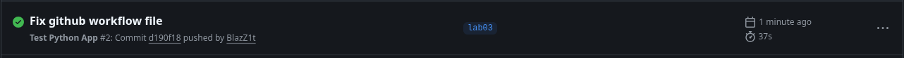

## Testing

- Pytest was chosen for its speed and ease of use
- Tests are structured as file per function, in the tests/ folder
- To run tests locally first run `pip install -r app_python/requirements-dev.txt` and then run `pytest .`

## Github Actions Pipeline
- Pipeline triggers on push and pull request with changes in app_python folder (excluding docs/) to not trigger the pipeline when not necessary
- Basic actions for checking out code and setting up python is self explanatory as well as docker actions, they are official and the best for the job. The action for getting current time was used to setup versioning
- I tag versions with current date
- https://github.com/BlazZ1t/devops-core-course-blazz1t/actions/runs/21946301431
- 

### Optimizations implemented
- Docker push job requires tests and linter to pass
- Dependencies are cached using setup-python action
- DockerHub credentials are stored as environment variables