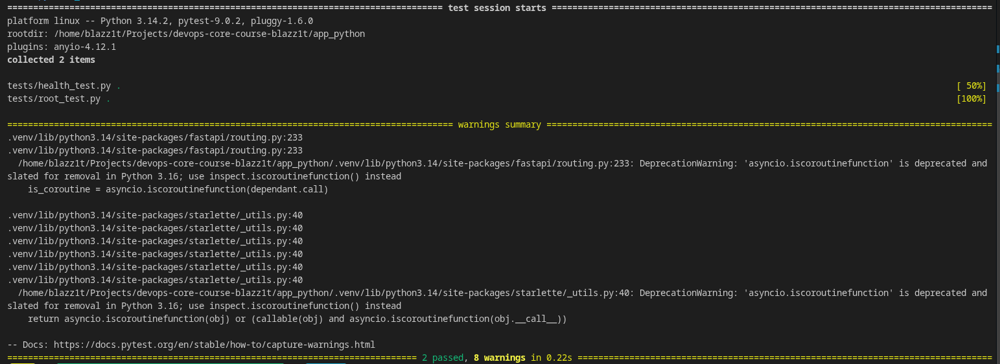

## Testing

- Pytest was chosen for its speed and ease of use
- Tests are structured as file per function, in the tests/ folder
- To run tests locally first run `pip install -r app_python/requirements-dev.txt` and then run `pytest .`

