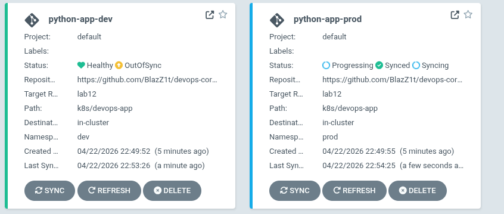
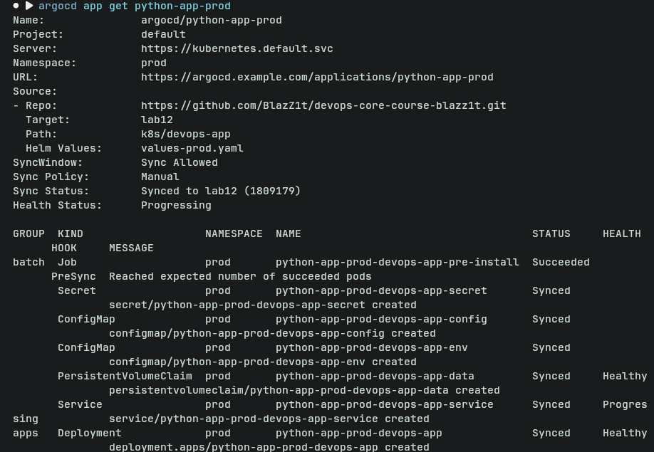
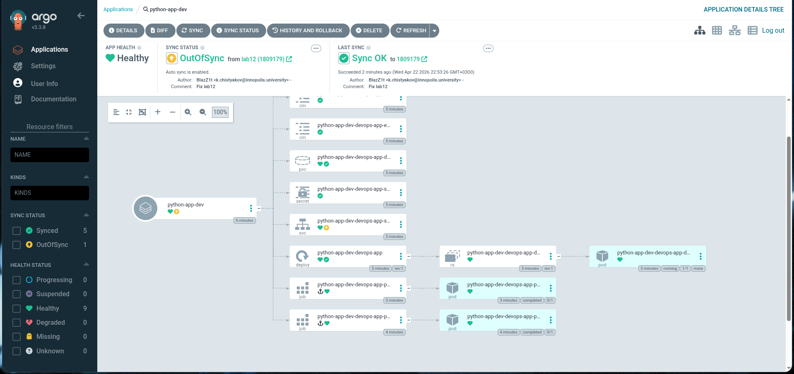

# Lab 13 --- GitOps with ArgoCD

## 1. ArgoCD Setup

### Installation Verification

ArgoCD was installed using Helm into a dedicated `argocd` namespace. All
components (API server, repo server, application controller) were
successfully deployed and verified using:

    kubectl get pods -n argocd

All pods reached the `Running` state.

### UI Access

The ArgoCD UI was accessed via port-forwarding:

    kubectl port-forward svc/argocd-server -n argocd 8080:443

Login credentials: - Username: `admin` - Password retrieved from:

    kubectl -n argocd get secret argocd-initial-admin-secret -o jsonpath="{.data.password}" | base64 -d

Access URL:

    https://localhost:8080

### CLI Configuration

The ArgoCD CLI was installed and configured:

    argocd login localhost:8080 --insecure

Verification:

    argocd app list

------------------------------------------------------------------------

## 2. Application Configuration

### Application Manifests

Applications were defined using declarative YAML manifests inside:

    k8s/argocd/

Each Application specifies: - Git repository (`repoURL`) - Branch
(`targetRevision`) - Helm chart path (`path`) - Values file
(`values.yaml`, `values-dev.yaml`, `values-prod.yaml`) - Destination
cluster and namespace

### Source and Destination

-   **Source:** Git repository containing Helm chart
-   **Destination:** Kubernetes cluster
    (`https://kubernetes.default.svc`)
-   Namespaces:
    -   `dev`
    -   `prod`

### Deployment Workflow

1.  Apply manifest:

```{=html}
<!-- -->
```
    kubectl apply -f k8s/argocd/

2.  Sync application:

```{=html}
<!-- -->
```
    argocd app sync <app-name>

3.  Verify:

```{=html}
<!-- -->
```
    argocd app get <app-name>

------------------------------------------------------------------------

## 3. Multi-Environment Deployment

### Namespace Separation

Two namespaces were created:

    kubectl create namespace dev
    kubectl create namespace prod

Each environment runs an independent instance of the application.

### Configuration Differences

  Environment   Replicas   Values File        Sync Policy
  ------------- ---------- ------------------ -------------
  Dev           Lower      values-dev.yaml    Automatic
  Prod          Higher     values-prod.yaml   Manual

### Sync Policies

#### Dev (Auto-Sync)

    syncPolicy:
      automated:
        prune: true
        selfHeal: true

-   Automatically applies changes from Git
-   Removes outdated resources
-   Reverts manual changes

#### Prod (Manual Sync)

    syncPolicy:
      syncOptions:
        - CreateNamespace=true

No automated sync is enabled.

### Rationale

Production uses manual sync because: - Requires review before
deployment - Prevents accidental rollouts - Allows controlled releases
and rollback planning

------------------------------------------------------------------------

## 4. Self-Healing Evidence

### 4.1 Manual Scale Test

Command:

    kubectl scale deployment python-app-dev -n dev --replicas=5

Observed behavior: - ArgoCD detected drift (replicas mismatch) -
Application status became `OutOfSync` - ArgoCD automatically reverted
replicas to Git-defined value

Result: - Replica count restored automatically

------------------------------------------------------------------------

### 4.2 Pod Deletion Test

Command:

    kubectl delete pod -n dev -l app.kubernetes.io/name=python-app

Observed behavior: - Kubernetes immediately recreated the pod - No
involvement from ArgoCD

Explanation: - This is Kubernetes self-healing via ReplicaSet

------------------------------------------------------------------------

### 4.3 Configuration Drift Test

Manual change: - Added label to deployment

Observed: - ArgoCD detected drift (`OutOfSync`) - Diff visible via:

    argocd app diff python-app-dev

-   Self-heal reverted the change automatically

------------------------------------------------------------------------

### 4.4 Sync Behavior Explanation

  Mechanism           Responsible Component   Behavior
  ------------------- ----------------------- ---------------------------------
  Pod recreation      Kubernetes              Maintains desired replica count
  Config correction   ArgoCD                  Ensures cluster matches Git

### Sync Trigger

ArgoCD sync is triggered by: - Git changes (polling every \~3 minutes) -
Manual sync via UI/CLI - Webhooks (optional)

------------------------------------------------------------------------

## 5. Screenshots

### Applications in ArgoCD



### Sync Status



### Application Details



------------------------------------------------------------------------

## Summary

This lab demonstrates a complete GitOps workflow using ArgoCD: -
Declarative application management - Git as single source of truth -
Multi-environment deployments - Automated synchronization and
self-healing

The system ensures that the Kubernetes cluster state continuously
matches the desired state defined in Git.
