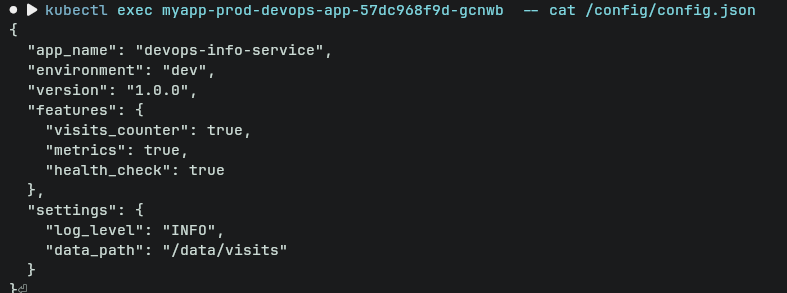
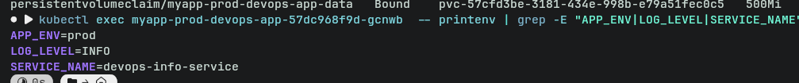
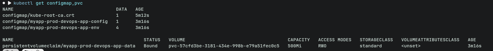
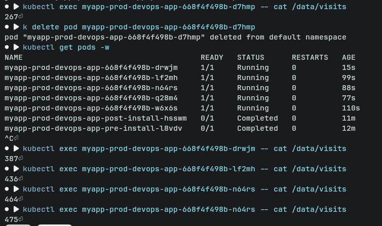

# ConfigMaps & Persistent Volumes — Lab 12

## 1. Application Changes

### Visits Counter Implementation

The application tracks total HTTP requests via a file-based counter at `/data/visits`.

**How it works:**
- On startup (`lifespan`), the app creates `/data/visits` with value `0` if it doesn't exist
- The `metrics_middleware` increments the counter on every HTTP response
- A dedicated `/visits` endpoint reads and returns the current count

**New endpoint:**

| Endpoint | Method | Response |
|----------|--------|----------|
| `/visits` | GET | `{"visits": <count>}` |

**Relevant code in `app_python/app.py`:**
- Startup init: lines 39–46
- Counter increment (middleware): lines 107–117
- `/visits` endpoint: lines 186–197

### Local Testing with Docker Compose

`app_python/docker-compose.yml` mounts `./data` to `/data` inside the container:

```yaml
volumes:
  - ./data:/data
```

**Test procedure:**
```bash
# Start the container
docker compose up -d

# Hit the root endpoint several times
curl http://localhost:8000/
curl http://localhost:8000/
curl http://localhost:8000/

# Check the counter
curl http://localhost:8000/visits
# {"visits": 3}

# Check the file on the host
cat ./data/visits
# 3

# Restart the container
docker compose restart

# Verify counter continues from last value
curl http://localhost:8000/visits
# {"visits": 3}
```

---

## 2. ConfigMap Implementation

### File-based ConfigMap (`templates/configmap.yaml`)

Loads `files/config.json` using Helm's `.Files.Get`:

```yaml
apiVersion: v1
kind: ConfigMap
metadata:
  name: {{ include "devops-app.fullname" . }}-config
data:
  config.json: |-
{{ .Files.Get "files/config.json" | indent 4 }}
```

**`files/config.json` content:**
```json
{
  "app_name": "devops-info-service",
  "environment": "dev",
  "version": "1.0.0",
  "features": {
    "visits_counter": true,
    "metrics": true,
    "health_check": true
  },
  "settings": {
    "log_level": "INFO",
    "data_path": "/data/visits"
  }
}
```

### Environment Variable ConfigMap (`templates/configmap-env.yaml`)

```yaml
apiVersion: v1
kind: ConfigMap
metadata:
  name: {{ include "devops-app.fullname" . }}-env
data:
  APP_ENV: {{ .Values.config.environment | quote }}
  LOG_LEVEL: {{ .Values.config.logLevel | quote }}
  SERVICE_NAME: {{ .Values.config.serviceName | quote }}
  VERSION: {{ .Chart.AppVersion | quote }}
```

Values are driven from `values.yaml`:
```yaml
config:
  environment: "dev"
  logLevel: "INFO"
  serviceName: "devops-info-service"
```

### Mounting ConfigMap as File

In `templates/deployment.yaml`, the file ConfigMap is mounted as a directory volume at `/config`:

```yaml
volumeMounts:
  - name: config-volume
    mountPath: /config

volumes:
  - name: config-volume
    configMap:
      name: <release>-devops-app-config
```

The file is accessible at `/config/config.json` inside the pod.

### Injecting ConfigMap as Environment Variables

The env ConfigMap is consumed via `envFrom`:

```yaml
envFrom:
  - secretRef:
      name: <release>-devops-app-secret
  - configMapRef:
      name: <release>-devops-app-env
```

This injects `APP_ENV`, `LOG_LEVEL`, `SERVICE_NAME`, and `VERSION` as environment variables.

### Verification

```bash
# Verify file is mounted
kubectl exec <pod> -- cat /config/config.json

# Verify environment variables
kubectl exec <pod> -- printenv | grep -E "APP_ENV|LOG_LEVEL|SERVICE_NAME"
```





**Expected outputs:**

`kubectl exec <pod> -- cat /config/config.json`:
```json
{
  "app_name": "devops-info-service",
  "environment": "dev",
  ...
}
```

`kubectl exec <pod> -- printenv | grep APP_ENV`:
```
APP_ENV=dev
```

> See screenshots in [screenshots_12/](screenshots_12/)

---

## 3. Persistent Volume

### PVC Configuration (`templates/pvc.yaml`)

```yaml
apiVersion: v1
kind: PersistentVolumeClaim
metadata:
  name: {{ include "devops-app.fullname" . }}-data
spec:
  accessModes:
    - ReadWriteOnce
  resources:
    requests:
      storage: {{ .Values.persistence.size }}
  {{- if .Values.persistence.storageClass }}
  storageClassName: {{ .Values.persistence.storageClass }}
  {{- end }}
```

**Values:**
```yaml
persistence:
  enabled: true
  size: 100Mi
  storageClass: ""  # Uses cluster default (standard on Minikube)
```

### Access Modes & Storage Class

- **ReadWriteOnce (RWO):** The volume can be mounted by a single node at a time. Suitable for single-replica workloads or pods scheduled on the same node. Minikube's default `standard` storage class provisions `hostPath` volumes automatically.
- **storageClass: ""** delegates to the cluster's default StorageClass, which on Minikube is `standard` (hostPath).

### Volume Mount Configuration

The PVC is mounted at `/data` where the app stores its visits file:

```yaml
volumeMounts:
  - name: data-volume
    mountPath: /data

volumes:
  - name: data-volume
    persistentVolumeClaim:
      claimName: <release>-devops-app-data
```

### Persistence Test

```bash
# Check current visit count
kubectl exec <pod> -- cat /data/visits
# 42

# Delete the pod (deployment will recreate it)
kubectl delete pod <pod-name>

# Wait for new pod
kubectl get pods -w

# Verify counter is preserved
kubectl exec <new-pod> -- cat /data/visits
# 42
```

> See screenshots in [screenshots_12/](screenshots_12/)

---

## 4. ConfigMap vs Secret

| | ConfigMap | Secret |
|---|---|---|
| **Use for** | Non-sensitive config: env names, feature flags, log levels, config files | Sensitive data: passwords, API keys, TLS certs, tokens |
| **Storage** | Stored in plain text in etcd | Stored base64-encoded in etcd (use encryption at rest for real security) |
| **Access** | Readable by any pod with the right RBAC | Restricted by RBAC; not shown in `kubectl describe` by default |
| **Visibility** | Visible in `kubectl get configmap -o yaml` | Values hidden in `kubectl describe secret` |
| **Examples** | `APP_ENV=prod`, `LOG_LEVEL=INFO`, `config.json` | `DB_PASSWORD`, `API_KEY`, TLS certificates |

**Rule of thumb:** If you'd be comfortable committing it to a public git repo, it's probably a ConfigMap. If not, it's a Secret.

---

## Bonus: ConfigMap Hot Reload

### Default Update Behavior

When a ConfigMap mounted as a **directory volume** (no `subPath`) is updated, the kubelet eventually syncs the new content to the pod. The delay is:

```
kubelet sync period (default 60s) + configmap cache TTL (default 60s) = up to ~2 minutes
```

```bash
# Edit the configmap
kubectl edit configmap <release>-devops-app-config

# Watch for file update inside pod (may take ~1-2 min)
kubectl exec <pod> -- watch cat /config/config.json
```

### subPath Limitation

When a ConfigMap key is mounted with `subPath`, the file is **copied** at mount time — it is not a symlink into the ConfigMap volume. Therefore it **does not receive live updates** when the ConfigMap changes. A pod restart is required.

Use `subPath` only when you need to inject a single file into an existing directory without overwriting other files. Avoid it when you need auto-updates.

### Checksum Annotation Pattern (Helm Upgrade Trigger)

The deployment includes checksum annotations that force a pod rollout whenever the ConfigMap content changes:

```yaml
annotations:
  checksum/config: {{ include (print $.Template.BasePath "/configmap.yaml") . | sha256sum }}
  checksum/config-env: {{ include (print $.Template.BasePath "/configmap-env.yaml") . | sha256sum }}
```

When `helm upgrade` is run after modifying `files/config.json` or env values, the checksum changes, causing the Deployment's pod template to change, which triggers a rolling restart.

```bash
# Change a value and upgrade
helm upgrade devops-app ./devops-app -f values-dev.yaml

# Pods will roll (checksum changed)
kubectl rollout status deployment/<release>-devops-app
```

> See screenshots in [screenshots_12/](screenshots_12/)
