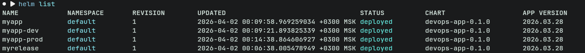
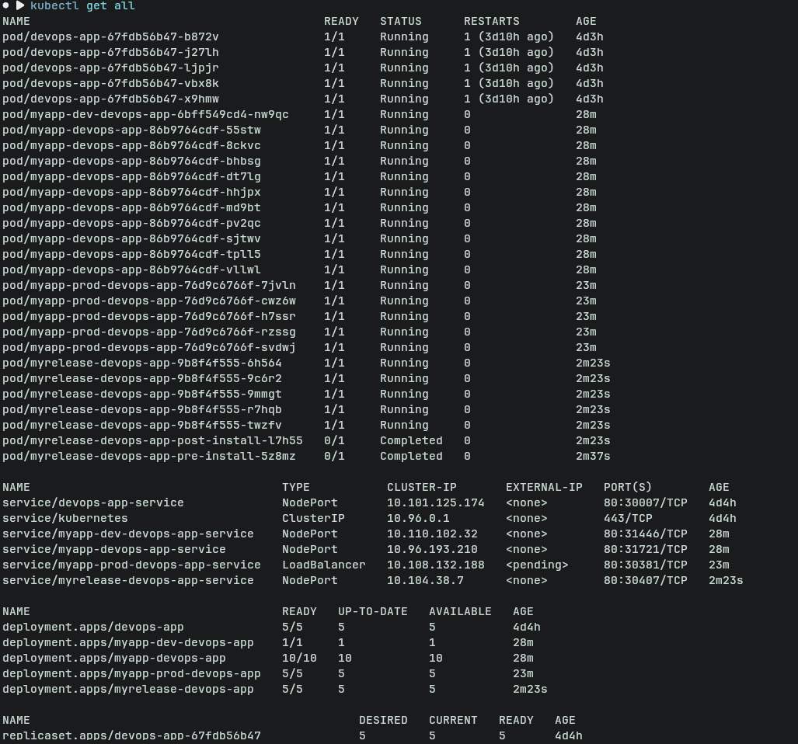
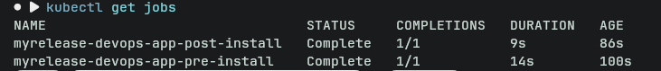
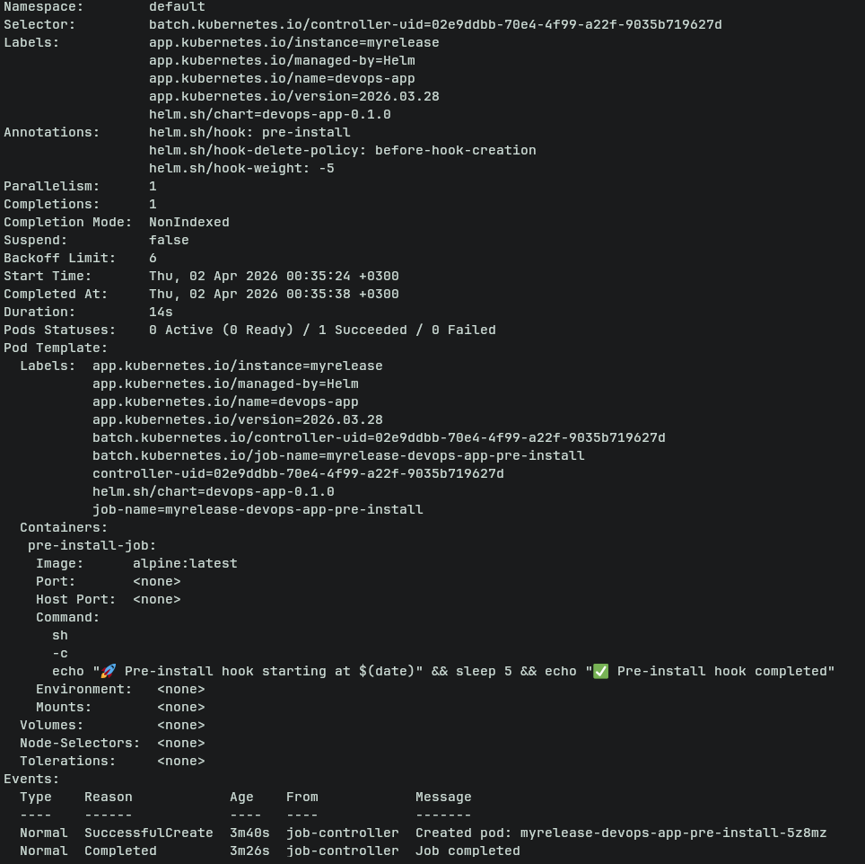
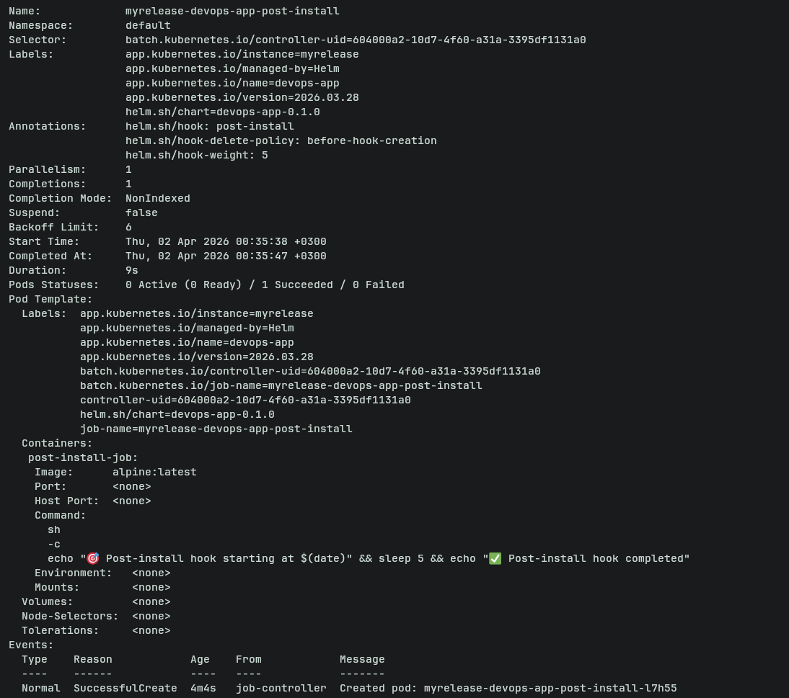
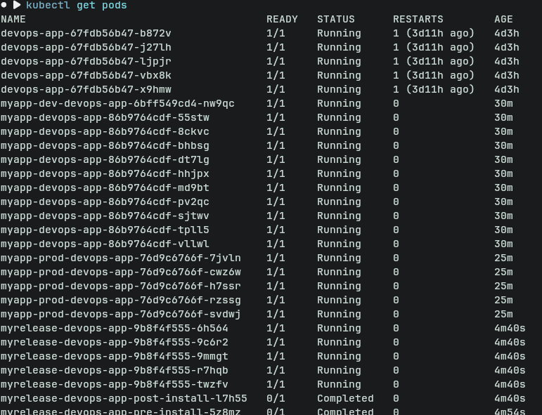
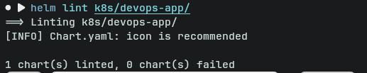
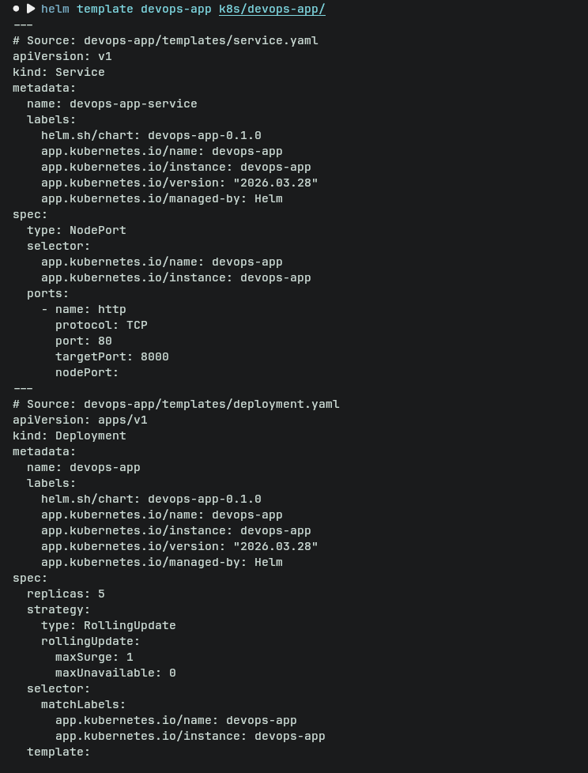

# Helm Chart Documentation: devops-app

## Chart Overview

### Chart Structure

    devops-app/
    ├── Chart.yaml
    ├── values.yaml
    ├── values-dev.yaml
    ├── values-prod.yaml
    └── templates/
        ├── _helpers.tpl
        ├── deployment.yaml
        ├── service.yaml
        └── hooks/
            ├── pre-install-job.yaml
            └── post-install-job.yaml

### Key Template Files

-   **deployment.yaml** -- Defines application Deployment with
    configurable replicas, probes, and resources.
-   **service.yaml** -- Exposes the application using NodePort or
    LoadBalancer.
-   \*\*\_helpers.tpl\*\* -- Contains reusable template helpers (naming,
    labels).
-   **hooks/pre-install-job.yaml** -- Pre-install Job hook.
-   **hooks/post-install-job.yaml** -- Post-install Job hook.

### Values Organization Strategy

-   `values.yaml` → Default (production-like baseline)
-   `values-dev.yaml` → Development overrides (lightweight, flexible)
-   `values-prod.yaml` → Production overrides (scalable, stable)

------------------------------------------------------------------------

## Configuration Guide

### Important Values

-   `replicaCount` -- Number of pod replicas
-   `image.repository/tag` -- Container image configuration
-   `service.type` -- NodePort (dev) vs LoadBalancer (prod)
-   `resources` -- CPU/memory limits and requests
-   `probes` -- Liveness and readiness checks
-   `rollingUpdate` -- Deployment strategy tuning

### Environment Customization

#### Development

-   Single replica
-   Latest image tag
-   NodePort service
-   Minimal resources

#### Production

-   Multiple replicas (5)
-   Fixed version tag
-   LoadBalancer service
-   Higher resource allocation
-   More aggressive health checks

### Example Installations

    # Development
    helm install dev-release ./devops-app -f values-dev.yaml

    # Production
    helm install prod-release ./devops-app -f values-prod.yaml

------------------------------------------------------------------------

## Hook Implementation

### Implemented Hooks

-   **Pre-install hook**
    -   Purpose: Validate or prepare environment before deployment
-   **Post-install hook**
    -   Purpose: Confirm successful deployment

### Execution Order

-   Pre-install: weight = -5 → runs first
-   Main resources deployed
-   Post-install: weight = 5 → runs last

### Deletion Policies

-   `before-hook-creation`
    -   Ensures old jobs are deleted before creating new ones
    -   Prevents resource conflicts

------------------------------------------------------------------------

## Installation Evidence

### Helm List Output

### Kubernetes Resources

    kubectl get all

 

### Hook Execution

    kubectl get jobs

    kubectl describe job <job-name>

### Different Deployments

------------------------------------------------------------------------

## Operations

### Install

    helm install <release-name> ./devops-app -f values.yaml

### Upgrade

    helm upgrade <release-name> ./devops-app -f values.yaml

### Rollback

    helm rollback <release-name> <revision>

### Uninstall

    helm uninstall <release-name>

------------------------------------------------------------------------

## Testing & Validation

### Helm Lint

    helm lint ./devops-app

### Template Rendering

    helm template ./devops-app

### Dry Run

    helm install --dry-run --debug dev-release ./devops-app

### Application Verification

-   Access via NodePort (dev)
-   Access via LoadBalancer (prod)
-   Health endpoint: `/health`

------------------------------------------------------------------------

## Summary

This Helm chart provides: - Flexible environment configuration -
Production-ready deployment strategy - Hook-based lifecycle management -
Strong validation and observability
