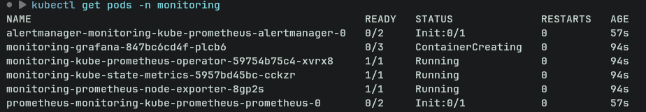
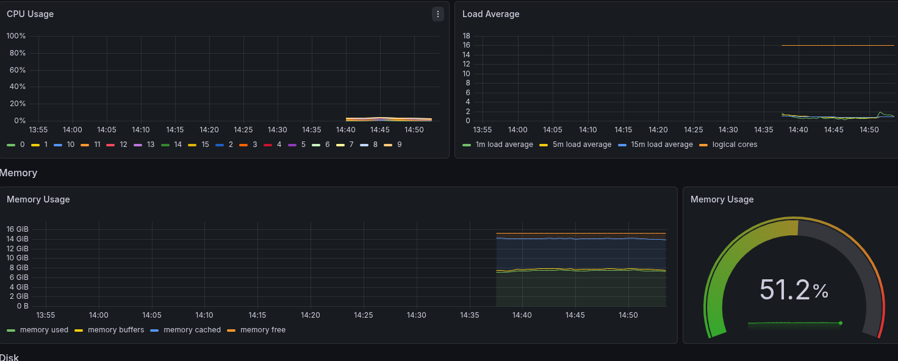
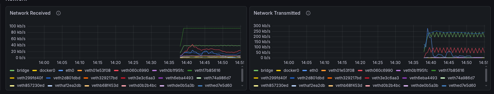
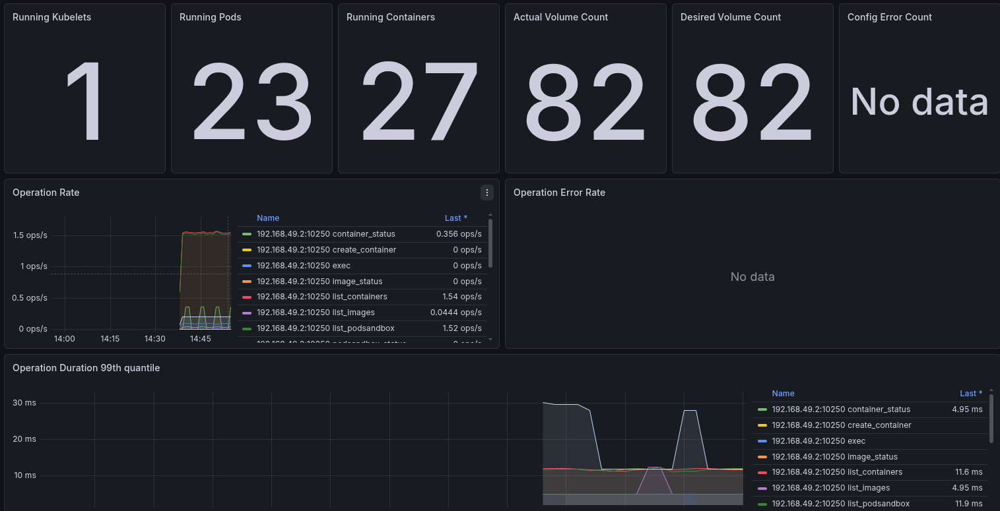
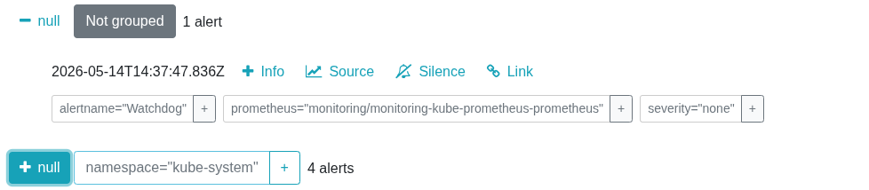
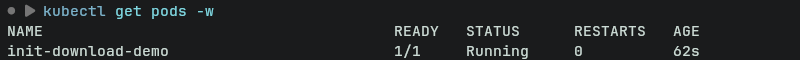
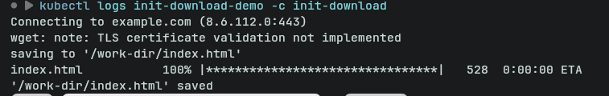
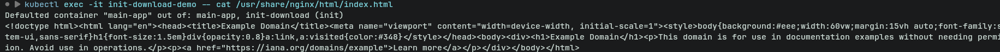
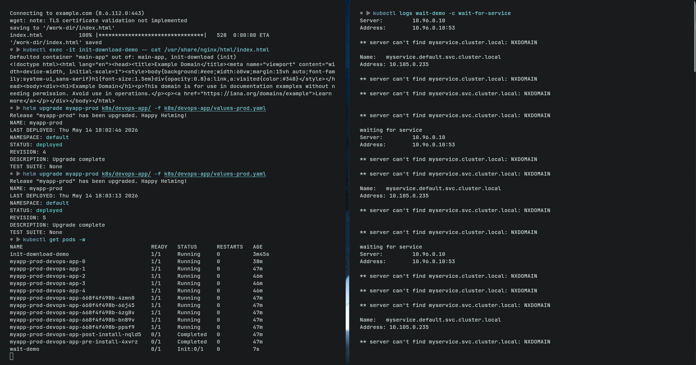

# Lab 16 — Kubernetes Monitoring & Init Containers


## Overview

This lab focused on implementing monitoring and observability in Kubernetes using the Kube-Prometheus stack and learning how init containers can be used to perform setup tasks before application startup.

The monitoring stack included:

- Prometheus
- Grafana
- Alertmanager
- kube-state-metrics
- node-exporter

Additionally, init containers were used for:

- Downloading files before application startup
- Waiting for dependencies/services before running the main application

---

# Task 1 — Kube-Prometheus Stack

## Stack Components

### Prometheus Operator

The Prometheus Operator automates the deployment and management of Prometheus-related resources inside Kubernetes. It simplifies configuration and manages custom resources such as `ServiceMonitor`.

### Prometheus

Prometheus collects and stores metrics from Kubernetes components and applications. It uses a pull-based model where metrics are scraped from configured endpoints.

Responsibilities:

- Metric collection
- Querying using PromQL
- Time-series storage

### Alertmanager

Alertmanager processes alerts generated by Prometheus and manages:

- Alert grouping
- Deduplication
- Notification routing

### Grafana

Grafana visualizes metrics collected by Prometheus through dashboards.

Used for:

- Cluster monitoring
- Resource analysis
- Network traffic analysis
- Pod and node monitoring

### kube-state-metrics

kube-state-metrics exposes Kubernetes object information as Prometheus metrics.

Examples:

- Pod states
- Deployment replicas
- StatefulSet status
- PVC status

### node-exporter

node-exporter exposes hardware and operating system metrics from Kubernetes nodes.

Examples:

- CPU usage
- Memory usage
- Disk usage
- Network statistics

---

# Installation

## Helm Repository

```bash
helm repo add prometheus-community https://prometheus-community.github.io/helm-charts
helm repo update
```

## Stack Installation

```bash
helm install monitoring prometheus-community/kube-prometheus-stack \
  --namespace monitoring \
  --create-namespace
```

## Verification Commands

```bash
kubectl get pods -n monitoring
kubectl get svc -n monitoring
```

## Example Output

```text
NAME                                                        READY   STATUS
monitoring-grafana                                          3/3     Running
monitoring-kube-prometheus-alertmanager-0                   2/2     Running
monitoring-kube-prometheus-operator                         1/1     Running
monitoring-kube-prometheus-prometheus-0                     2/2     Running
monitoring-kube-state-metrics                               1/1     Running
monitoring-prometheus-node-exporter                         1/1     Running
```

---

## Screenshot — Monitoring Stack Running



---

# Task 2 — Grafana Dashboard Exploration

## Grafana Access

```bash
kubectl port-forward svc/monitoring-grafana -n monitoring 3000:80
```

Default credentials:

```text
Username: admin
Password: prom-operator
```

---

# Dashboard Answers

## 1. Pod Resources

Observed CPU and memory usage for the StatefulSet pods through Grafana dashboards.

Result:

```text
Approximate memory usage: 7 GB
```

## 2. Namespace Analysis

Checked the "Kubernetes / Compute Resources / Namespace (Pods)" dashboard.

Result:

```text
No data available
```

## 3. Node Metrics

Using the "Node Exporter / Nodes" dashboard:

```text
Memory usage: 75%
CPU usage: 3%
```

## 4. Kubelet Metrics

Using the "Kubernetes / Kubelet" dashboard:

```text
Managed pods: 23
Managed containers: 27
```

## 5. Network Usage

Observed network traffic in the default namespace.

```text
Receiving traffic: 1 MB/s
Transmitted traffic: 0.7 kB/s
```

## 6. Active Alerts

Checked Alertmanager UI.

```text
Active alerts: 5
```

---

## Screenshot — Resource Usage



---

## Screenshot — Network Usage



---

## Screenshot — Kubelet Metrics



---

## Screenshot — Alert Count



---

# Task 3 — Init Containers

## Basic Init Container

An init container was created to download a file before the main application started.

## Init Container Configuration

```yaml
spec:
  initContainers:
    - name: init-download
      image: busybox:1.36
      command:
        - sh
        - -c
        - wget -O /work-dir/index.html https://example.com

      volumeMounts:
        - name: workdir
          mountPath: /work-dir

  containers:
    - name: main-app
      image: nginx

      volumeMounts:
        - name: workdir
          mountPath: /data

  volumes:
    - name: workdir
      emptyDir: {}
```

## Verification

Commands used:

```bash
kubectl logs <pod> -c init-download
kubectl exec <pod> -- cat /data/index.html
```

The downloaded file was successfully available inside the main container.

---

## Screenshot — Init Download Running



---

## Screenshot — Successful Download



---

## Screenshot — Downloaded Contents



---

# Wait-for-Service Pattern

A second init container pattern was implemented to wait for a dependency before application startup.

## Wait Container Configuration

```yaml
initContainers:
  - name: wait-for-service
    image: busybox:1.36
    command:
      - sh
      - -c
      - until nslookup myservice; do sleep 2; done
```

The main container only started after the dependency became available.

## Verification

```bash
kubectl get pods -w
```

Observed transition:

```text
Init:0/1 -> Running
```

---

## Screenshot — Waiting Container



---

# Bonus Task — Custom Metrics & ServiceMonitor

## Metrics Endpoint

A `/metrics` endpoint was added using a Prometheus client library to expose application metrics.

## ServiceMonitor

```yaml
apiVersion: monitoring.coreos.com/v1
kind: ServiceMonitor
metadata:
  name: myapp-monitor
  labels:
    release: monitoring

spec:
  selector:
    matchLabels:
      app.kubernetes.io/name: myapp

  endpoints:
    - port: http
      path: /metrics
```

## Prometheus Access

```bash
kubectl port-forward svc/monitoring-kube-prometheus-prometheus -n monitoring 9090:9090
```

Metrics were successfully visible in Prometheus UI.

---

# Conclusion

This lab demonstrated how Kubernetes monitoring can be implemented using the Kube-Prometheus stack and how init containers can prepare application environments before startup.

Key concepts learned:

- Cluster observability using Prometheus and Grafana
- Monitoring Kubernetes resources and workloads
- Alert inspection using Alertmanager
- Init container lifecycle
- Dependency waiting patterns
- Shared volumes between containers

The monitoring stack successfully collected cluster metrics and the init containers correctly handled initialization logic before application execution.
