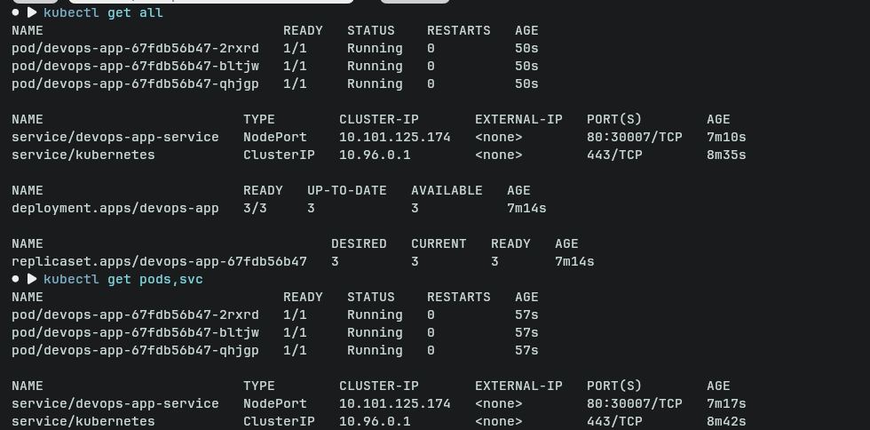
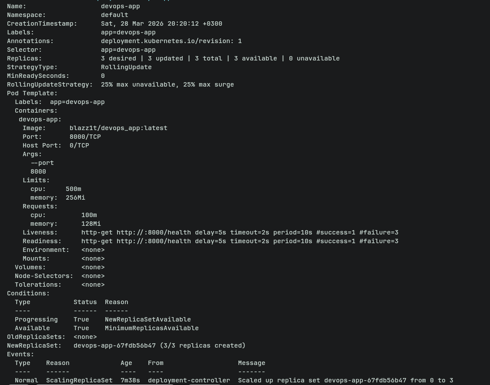
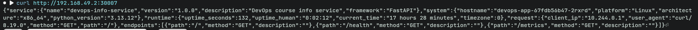
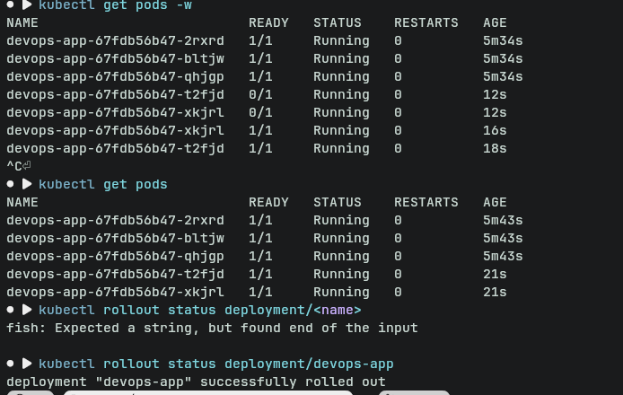
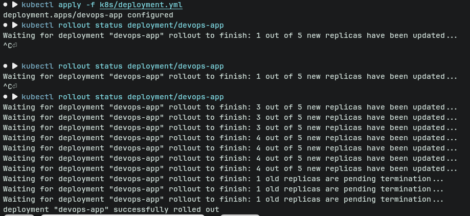
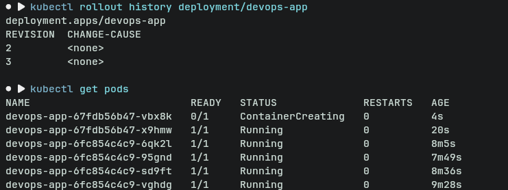

# Kubernetes Deployment Report — DevOps App

## Architecture Overview

### Deployment Architecture
This application is deployed on a Kubernetes cluster (Minikube) using:

- **Deployment**: `devops-app`
- **Replicas**: 3 Pods
- **Service**: NodePort (`devops-app-service`)
- **Container runtime**: Docker image (`blazz1t/devops_app`)

### Networking Flow
Client → NodePort Service → Pod (Uvicorn app on port 8000)

- External traffic enters via NodePort
- Service routes traffic using label selector (`app: devops-app`)
- Load is distributed across 3 Pods

### Resource Allocation Strategy
- Requests:
  - CPU: 100m
  - Memory: 128Mi
- Limits:
  - CPU: 500m
  - Memory: 256Mi

This ensures:
- Fair scheduling (requests)
- Protection against resource exhaustion (limits)

---

## Manifest Files

### deployment.yml
Defines:
- 3 replicas for high availability
- Rolling update strategy:
  - `maxSurge: 1`
  - `maxUnavailable: 0`
- Resource limits and requests
- Liveness and readiness probes (`/health`)
- Container args for port configuration

**Why these values:**
- 3 replicas → zero downtime + redundancy
- maxUnavailable=0 → guarantees availability
- resource limits → prevent noisy neighbor issues

---

### service.yml
Defines:
- Type: NodePort (for Minikube access)
- Port mapping:
  - Port 80 → targetPort 8000

**Why:**
- NodePort allows external access in local cluster
- Clean separation between service port and container port

---

## Deployment Evidence

### Cluster State


### Deployment Description


### Application Working (curl)


---

## Operations Performed

### Deployment Commands
```bash
kubectl apply -f k8s/deployment.yml
kubectl apply -f k8s/service.yml
```

### Scaling Demonstration


### Rolling Update


Command used:
```bash
kubectl set image deployment/devops-app devops-app=blazz1t/devops_app:v2
```

### Rollback


Command:
```bash
kubectl rollout undo deployment/devops-app
```

### Service Access
```bash
minikube service devops-app-service
```

or

```bash
kubectl port-forward service/devops-app-service 8080:80
```

---

## Production Considerations

### Health Checks
- `/health` endpoint used for:
  - Liveness → restart unhealthy containers
  - Readiness → control traffic routing

### Resource Limits Rationale
- Prevents a single pod from exhausting node resources
- Ensures predictable scheduling

### Improvements for Production
- Use Ingress instead of NodePort
- Add HTTPS (TLS)
- Use ConfigMaps & Secrets
- Implement autoscaling (HPA)

### Monitoring & Observability
- Metrics: Prometheus + Grafana
- Logging: EFK/ELK stack
- Alerts: Alertmanager

---

## Challenges & Solutions

### Issues Encountered
- Pods stuck in `ContainerCreating`
- Kubernetes trying to connect to localhost:8080
- Image pull issues

### Debugging Approach
- `kubectl describe pod`
- `kubectl get events`
- Checked Minikube status and context

### Key Learnings
- Difference between container port vs service port
- Importance of labels/selectors
- Rolling updates mechanics
- Debugging with `describe` and events is critical
