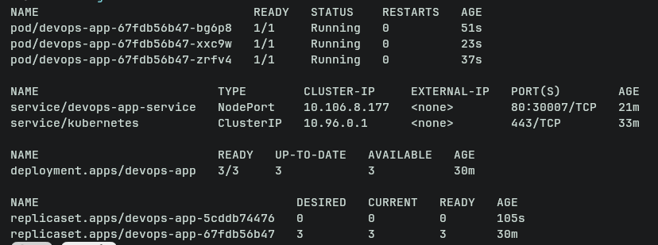
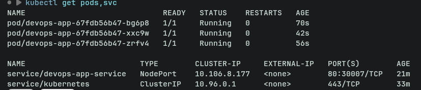
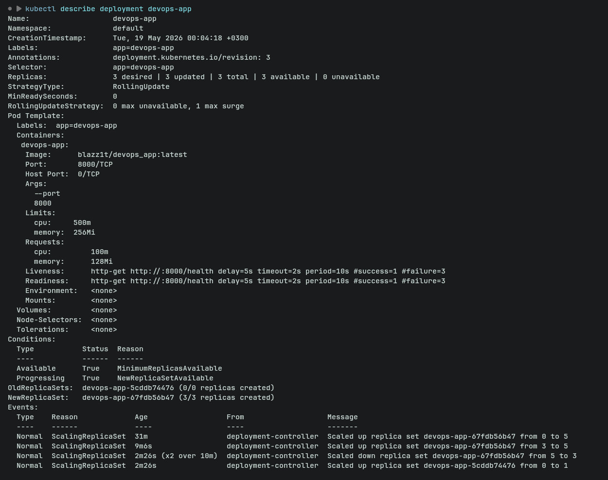
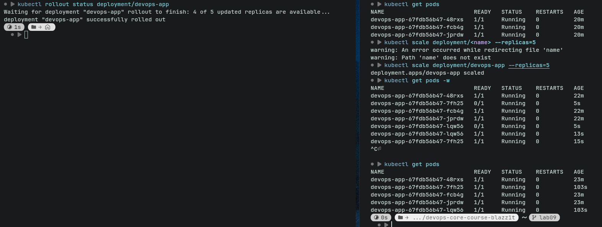
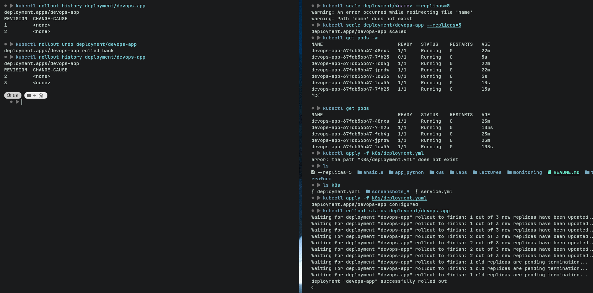

# Lab 9 — Kubernetes Fundamentals

## Overview

This lab focused on deploying a containerized FastAPI application to a local Kubernetes cluster using declarative manifests and production-oriented Kubernetes practices. The deployment includes a Kubernetes Deployment with rolling updates, health checks, and resource limits, as well as a NodePort Service for external accessibility.

**Cluster Technology:** Minikube
**Kubernetes Version:** 1.33+
**Container Runtime:** Docker
**Application Framework:** FastAPI
**Container Image:** `blazz1t/devops_app:2026.04.20`

---

# 1. Architecture Overview

## Deployment Architecture

The application is deployed into a Minikube Kubernetes cluster using the following architecture:

```text
                    +----------------------+
                    |      NodePort        |
                    |   devops-app-service |
                    |      Port: 80        |
                    +----------+-----------+
                               |
                               v
                  +------------+------------+
                  |        Deployment       |
                  |       devops-app        |
                  |      Replicas: 3        |
                  +------------+------------+
                               |
        -------------------------------------------------
        |                       |                       |
        v                       v                       v
+---------------+     +---------------+     +---------------+
|   Pod #1      |     |   Pod #2      |     |   Pod #3      |
| FastAPI App   |     | FastAPI App   |     | FastAPI App   |
| Port: 8000    |     | Port: 8000    |     | Port: 8000    |
+---------------+     +---------------+     +---------------+
```

## Networking Flow

1. External traffic enters through the Kubernetes NodePort Service.
2. The Service routes traffic to healthy Pods using label selectors.
3. The Deployment ensures the desired number of replicas remain running.
4. Liveness and readiness probes continuously verify application health.

## Resource Allocation Strategy

The application uses conservative resource requests and limits suitable for local development and lightweight production workloads:

| Resource | Request | Limit |
| -------- | ------- | ----- |
| CPU      | 100m    | 500m  |
| Memory   | 128Mi   | 256Mi |

### Rationale

* **Requests** guarantee minimum resources for scheduling.
* **Limits** prevent Pods from consuming excessive cluster resources.
* The values are appropriate for a lightweight FastAPI API service.

---

# 2. Kubernetes Setup

## Why Minikube?

Minikube was selected because it provides a simple and complete local Kubernetes environment with built-in support for:

* Kubernetes control plane components
* NodePort services
* Ingress addons
* Easy local development and debugging
* Quick startup and teardown

Minikube is ideal for learning Kubernetes concepts locally before deploying workloads to cloud-managed clusters.

## Cluster Verification Commands

```bash
kubectl cluster-info
kubectl get nodes
kubectl get namespaces
```

## Example Cluster Output

```bash
$ kubectl cluster-info
Kubernetes control plane is running at https://127.0.0.1:6443
CoreDNS is running at https://127.0.0.1:6443/api/v1/namespaces/kube-system/services/kube-dns:dns/proxy

$ kubectl get nodes
NAME       STATUS   ROLES           AGE   VERSION
minikube   Ready    control-plane   1d    v1.33.x
```

---

# 3. Manifest Files

## Deployment Manifest — `k8s/deployment.yml`

The Deployment manifest defines the desired application state and manages Pods automatically.

### Key Features

* 3 application replicas
* Rolling update strategy
* Resource requests and limits
* Liveness and readiness probes
* Label-based Pod selection
* Declarative deployment management

## Deployment Manifest

```yaml
apiVersion: apps/v1
kind: Deployment
metadata:
  name: devops-app
  labels:
    app: devops-app
spec:
  replicas: 3
  strategy:
    type: RollingUpdate
    rollingUpdate:
      maxSurge: 1
      maxUnavailable: 0
  selector:
    matchLabels:
      app: devops-app
  template:
    metadata:
      labels:
        app: devops-app
    spec:
      containers:
        - name: devops-app
          image: blazz1t/devops_app:2026.04.20
          args: ["--port", "8000"]
          ports:
            - containerPort: 8000

          resources:
            requests:
              cpu: "100m"
              memory: "128Mi"
            limits:
              cpu: "500m"
              memory: "256Mi"

          livenessProbe:
            httpGet:
              path: /health
              port: 8000
            initialDelaySeconds: 5
            periodSeconds: 10
            timeoutSeconds: 2
            failureThreshold: 3

          readinessProbe:
            httpGet:
              path: /health
              port: 8000
            initialDelaySeconds: 5
            periodSeconds: 10
            timeoutSeconds: 2
            failureThreshold: 3
```

## Service Manifest — `k8s/service.yml`

The Service exposes the Deployment externally using a NodePort.

### Key Features

* NodePort service type
* Stable networking endpoint
* Load balancing across Pods
* Label selector targeting application Pods

## Service Manifest

```yaml
apiVersion: v1
kind: Service
metadata:
  name: devops-app-service
  labels:
    app: devops-app
spec:
  type: NodePort
  selector:
    app: devops-app
  ports:
    - name: http
      protocol: TCP
      port: 80
      targetPort: 8000
      nodePort: 30007
```

---

# 4. Application Description

The deployed application is a FastAPI-based DevOps information service.

## Application Features

* REST API built with FastAPI
* JSON structured logging
* Health endpoint for Kubernetes probes
* Prometheus metrics endpoint
* Runtime and system information reporting
* Request monitoring and metrics collection

## Available Endpoints

| Endpoint   | Description                 |
| ---------- | --------------------------- |
| `/`        | Main application endpoint   |
| `/health`  | Health check endpoint       |
| `/metrics` | Prometheus metrics endpoint |

## Health Checks

Both liveness and readiness probes use the `/health` endpoint.

### Why This Endpoint Was Chosen

The `/health` endpoint:

* Returns lightweight JSON responses
* Verifies application responsiveness
* Allows Kubernetes to restart unhealthy containers
* Prevents traffic routing to unavailable Pods

Example response:

```json
{
  "status": "healthy",
  "timestamp": "2026-05-18T22:10:00",
  "uptime_seconds": 120
}
```

---

# 5. Deployment Operations

## Applying Kubernetes Resources

```bash
kubectl apply -f k8s/deployment.yml
kubectl apply -f k8s/service.yml
```

## Verifying Resources

```bash
kubectl get deployments
kubectl get pods
kubectl get services
kubectl get all
```

## Deployment Description

```bash
kubectl describe deployment devops-app
```

## Accessing the Service

```bash
minikube service devops-app-service
```

Alternatively:

```bash
kubectl port-forward service/devops-app-service 8080:80
```

The application becomes accessible through the browser or curl.

Example:

```bash
curl http://127.0.0.1:8080/health
```

---

# 6. Scaling Demonstration

## Scaling to 5 Replicas

The Deployment was scaled from 3 to 5 replicas.

### Command Used

```bash
kubectl scale deployment/devops-app --replicas=5
```

## Verifying Scaling

```bash
kubectl get pods
kubectl rollout status deployment/devops-app
```

Kubernetes automatically scheduled and created additional Pods to match the desired state.

---

# 7. Rolling Updates and Rollbacks

## Rolling Update Strategy

The Deployment uses a rolling update strategy configured with:

```yaml
strategy:
  type: RollingUpdate
  rollingUpdate:
    maxSurge: 1
    maxUnavailable: 0
```

### Benefits

* Zero downtime deployments
* Gradual replacement of old Pods
* Continuous application availability
* Safe deployment process

## Performing a Rolling Update

An updated image version or configuration can be applied using:

```bash
kubectl apply -f k8s/deployment.yml
```

## Monitoring Rollout Status

```bash
kubectl rollout status deployment/devops-app
kubectl rollout history deployment/devops-app
```

## Rollback Demonstration

Rollback capability was verified using:

```bash
kubectl rollout undo deployment/devops-app
```

Kubernetes restored the previous ReplicaSet automatically.

---

# 8. Deployment Evidence

## kubectl get all



## kubectl get pods,svc



## Deployment Description



## Scaling Demonstration



## Rolling Update Output



---

# 9. Production Considerations

## Resource Limits

Resource requests and limits help:

* Prevent resource starvation
* Improve cluster stability
* Enable efficient scheduling
* Avoid noisy neighbor problems

## Health Monitoring

Liveness and readiness probes improve reliability by:

* Restarting failed containers automatically
* Preventing traffic from reaching unhealthy Pods
* Supporting rolling updates safely

## Future Improvements

If deploying this workload to production, the following improvements would be implemented:

### Security

* Use Kubernetes Secrets for sensitive values
* Enable Pod Security Standards
* Add network policies
* Use image signing and vulnerability scanning

### Observability

* Deploy Prometheus and Grafana
* Add centralized logging with Loki or ELK
* Configure alerting rules
* Add distributed tracing

### Scalability

* Horizontal Pod Autoscaler (HPA)
* Cluster autoscaling
* Multi-node cluster deployment

### Reliability

* Ingress controller with TLS
* Canary deployments
* Multi-environment GitOps workflow
* Persistent monitoring dashboards

---

# 10. Challenges and Solutions

## Challenges Encountered

### 1. Probe Configuration

Initially, readiness probes failed because the application startup timing was too aggressive.

### Solution

Adjusted:

* `initialDelaySeconds`
* `periodSeconds`
* probe timeout values

This allowed the application enough time to initialize before health checks began.

---

### 2. Service Accessibility

Accessing the application externally required understanding the relationship between:

* Service ports
* Container ports
* NodePort mappings

### Solution

Used:

```bash
minikube service devops-app-service
```

to expose the application correctly.

---

### 3. Understanding Declarative Kubernetes

One major learning outcome was understanding how Kubernetes continuously reconciles actual cluster state with the desired declarative state.

This reinforced concepts such as:

* Controllers
* Desired state management
* ReplicaSets
* Self-healing infrastructure
* Rolling deployments

---

# 11. Key Learnings

Through this lab, the following Kubernetes concepts were learned and practiced:

* Kubernetes architecture fundamentals
* Declarative resource management
* Deployments and ReplicaSets
* Services and networking
* Resource requests and limits
* Health checks and probes
* Rolling updates and rollbacks
* Scaling applications
* Cluster debugging with kubectl

The lab demonstrated how Kubernetes automates orchestration tasks that would otherwise require manual operational management.

---

# 12. Useful Commands Reference

## Cluster Commands

```bash
kubectl cluster-info
kubectl get nodes
kubectl get namespaces
```

## Deployment Commands

```bash
kubectl apply -f k8s/deployment.yml
kubectl get deployments
kubectl describe deployment devops-app
```

## Pod Commands

```bash
kubectl get pods
kubectl logs <pod-name>
kubectl describe pod <pod-name>
```

## Service Commands

```bash
kubectl get services
kubectl describe service devops-app-service
```

## Scaling and Rollouts

```bash
kubectl scale deployment/devops-app --replicas=5
kubectl rollout status deployment/devops-app
kubectl rollout history deployment/devops-app
kubectl rollout undo deployment/devops-app
```

---

# Conclusion

This lab successfully demonstrated the deployment and management of a production-oriented FastAPI application on Kubernetes using Minikube.

The implementation included:

* Declarative manifests
* Rolling updates
* Resource management
* Health checks
* NodePort networking
* Scaling operations
* Rollback capabilities

The project provided practical experience with Kubernetes fundamentals and established a strong foundation for future topics such as Helm, GitOps, observability, and advanced traffic management.
