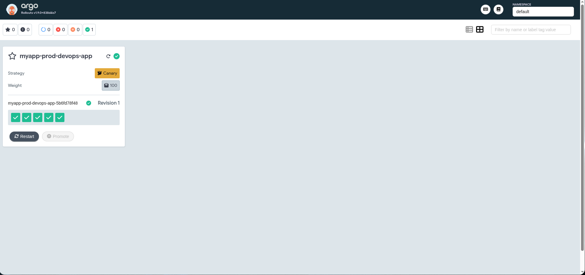
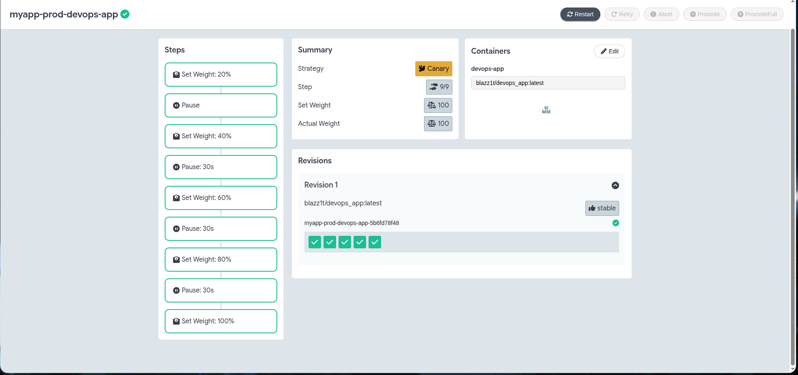
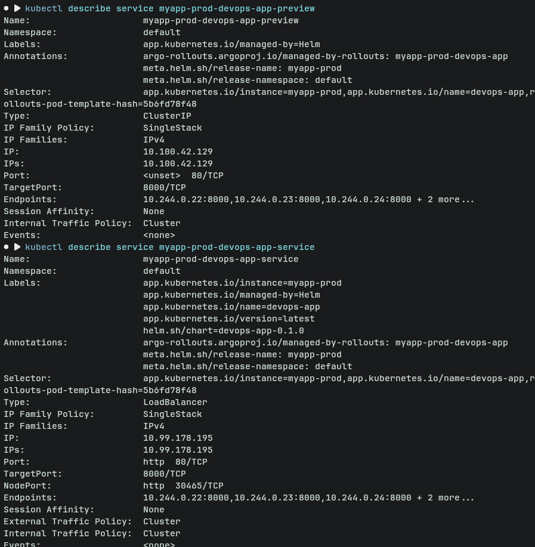

# Argo Rollouts — Progressive Delivery

## 1. Argo Rollouts Setup

### Installation

```bash
# Create namespace and install controller
kubectl create namespace argo-rollouts
kubectl apply -n argo-rollouts -f https://github.com/argoproj/argo-rollouts/releases/latest/download/install.yaml

# Install kubectl plugin (Linux)
curl -LO https://github.com/argoproj/argo-rollouts/releases/latest/download/kubectl-argo-rollouts-linux-amd64
chmod +x kubectl-argo-rollouts-linux-amd64
sudo mv kubectl-argo-rollouts-linux-amd64 /usr/local/bin/kubectl-argo-rollouts

# Verify installation
kubectl argo rollouts version
# kubectl-argo-rollouts: v1.9.0+838d4e7
```

### Dashboard

```bash
# Install dashboard
kubectl apply -n argo-rollouts -f https://github.com/argoproj/argo-rollouts/releases/latest/download/dashboard-install.yaml

# Access via port-forward
kubectl port-forward svc/argo-rollouts-dashboard -n argo-rollouts 3100:3100
# Open http://localhost:3100
```

### Rollout vs Deployment

| Feature | Deployment | Rollout |
|---|---|---|
| `apiVersion` | `apps/v1` | `argoproj.io/v1alpha1` |
| `kind` | `Deployment` | `Rollout` |
| Strategy types | `RollingUpdate`, `Recreate` | `canary`, `blueGreen` |
| Traffic shifting | Not supported | Percentage-based |
| Manual promotion | Not supported | `pause: {}` step |
| Automated rollback | Not supported | Metrics-based via AnalysisTemplate |
| Preview environment | Not supported | `previewService` field |

The pod template spec (`containers`, `volumes`, `probes`, etc.) is identical between the two. The key addition is the `strategy` block under `spec`, which unlocks progressive delivery features.

---

## 2. Canary Deployment

### Strategy Configuration

The rollout was configured with a graduated canary strategy in `devops-app/templates/rollout.yaml`:

```yaml
strategy:
  canary:
    steps:
      - setWeight: 20
      - pause: {}          # manual promotion required
      - setWeight: 40
      - pause:
          duration: 30s
      - setWeight: 60
      - pause:
          duration: 30s
      - setWeight: 80
      - pause:
          duration: 30s
      - setWeight: 100
```

This progressively shifts traffic from the stable version to the canary, giving time to observe the new version's behavior before full rollout.

### Rollout Progression

The dashboard shows the rollout `myapp-prod-devops-app` with **Canary** strategy and all 9 steps completed (step 9/9, weight 100):



The detail view shows all configured steps and the final stable revision:



### CLI Commands Used

```bash
# Watch live status
kubectl argo rollouts get rollout myapp-prod-devops-app -w

# Manually promote through the first pause step
kubectl argo rollouts promote myapp-prod-devops-app

# Abort a running rollout (triggers rollback to stable)
kubectl argo rollouts abort myapp-prod-devops-app

# Retry after an abort
kubectl argo rollouts retry rollout myapp-prod-devops-app
```

### Rollback Behavior

When `abort` is issued during a canary rollout, Argo Rollouts immediately shifts all traffic back to the stable revision. The canary pods remain until the rollout is retried or a new revision is deployed, but they receive 0% of traffic.

---

## 3. Blue-Green Deployment

### Strategy Configuration

The rollout was reconfigured for blue-green by updating the `strategy` block:

```yaml
strategy:
  blueGreen:
    activeService: myapp-prod-devops-app-service   # production traffic
    previewService: myapp-prod-devops-app-preview  # new version for testing
    autoPromotionEnabled: false                    # require manual promotion
```

### Services

Two services are required:

**Active service** (`devops-app/templates/service.yaml`) — serves production traffic, managed by Argo Rollouts which updates its selector to point to the current stable ReplicaSet:

```yaml
apiVersion: v1
kind: Service
metadata:
  name: myapp-prod-devops-app-service
spec:
  type: LoadBalancer
  selector:
    app.kubernetes.io/instance: myapp-prod
    app.kubernetes.io/name: devops-app
    rollouts-pod-template-hash: <stable-hash>
```

**Preview service** (`devops-app/templates/preview-service.yaml`) — automatically pointed at the new (green) ReplicaSet during a rollout:

```yaml
apiVersion: v1
kind: Service
metadata:
  name: myapp-prod-devops-app-preview
spec:
  type: ClusterIP
  selector:
    app.kubernetes.io/instance: myapp-prod
    app.kubernetes.io/name: devops-app
    rollouts-pod-template-hash: <canary-hash>
```

The screenshot below shows both services live — the preview (ClusterIP) and the active (LoadBalancer) — both with endpoints, confirming the green pods are running and accessible before promotion:



### Blue-Green Flow

```bash
# 1. Deploy initial version (blue becomes active)
helm upgrade --install myapp-prod ./devops-app

# 2. Trigger a new rollout (update image tag or any value)
helm upgrade myapp-prod ./devops-app --set image.tag=latest

# 3. Green pods start; preview service routes to them
kubectl port-forward svc/myapp-prod-devops-app-preview 8081:80
# Verify the new version at http://localhost:8081

# 4. Promote green to active (instant selector swap)
kubectl argo rollouts promote myapp-prod-devops-app

# 5. Active service now routes to green; blue pods are scaled down
```

### Instant Rollback

After promotion, rolling back is immediate — Argo Rollouts swaps the active service selector back to the previous ReplicaSet (which is still running):

```bash
kubectl argo rollouts undo myapp-prod-devops-app
```

The switch happens in milliseconds because no new pods need to be scheduled.

---

## 4. Strategy Comparison

| | Canary | Blue-Green |
|---|---|---|
| Traffic shift | Gradual (percentage steps) | Instant (all-or-nothing) |
| Rollback speed | Gradual (traffic shifts back) | Instant (selector swap) |
| Resource usage | Shared — only a few canary pods | Double — full replica set for each version |
| Risk exposure | Subset of users hit new version | No users until promotion |
| Preview testing | Limited (% of real traffic) | Full environment via preview service |
| Best for | High-traffic apps where gradual validation reduces blast radius | Apps requiring a full staging environment before any user traffic |

**Recommendation:**
- Use **canary** when you want to validate a new version with real production traffic incrementally and have metrics to back the decision (e.g., error rate, latency).
- Use **blue-green** when you need a complete, isolated environment to QA or smoke-test the new version before it touches any user, and can afford the extra resource cost. It also suits cases where instant rollback is a hard requirement (e.g., financial or compliance-sensitive services).

---

## 5. CLI Reference

```bash
# List all rollouts
kubectl argo rollouts list rollouts

# Get rollout status (live)
kubectl argo rollouts get rollout <name> -w

# Manually promote to next step (or full promotion)
kubectl argo rollouts promote <name>
kubectl argo rollouts promote <name> --full

# Abort a rollout (shifts traffic back to stable)
kubectl argo rollouts abort <name>

# Retry an aborted rollout
kubectl argo rollouts retry rollout <name>

# Roll back to previous revision
kubectl argo rollouts undo <name>

# Restart all pods in a rollout
kubectl argo rollouts restart <name>

# Access dashboard
kubectl port-forward svc/argo-rollouts-dashboard -n argo-rollouts 3100:3100
```
