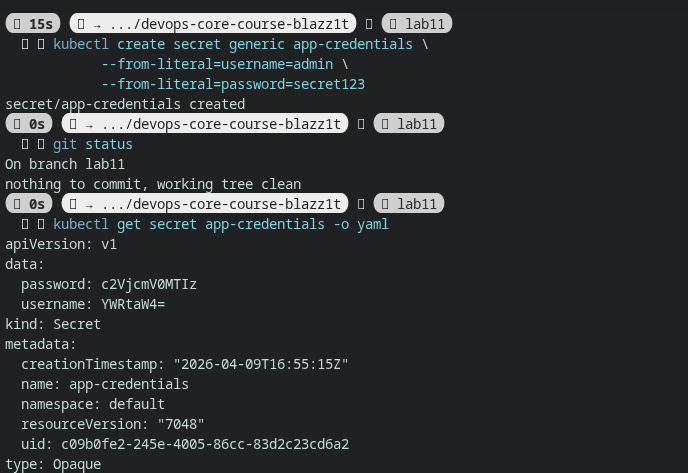
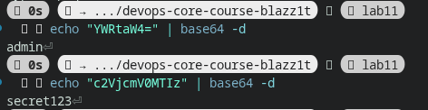
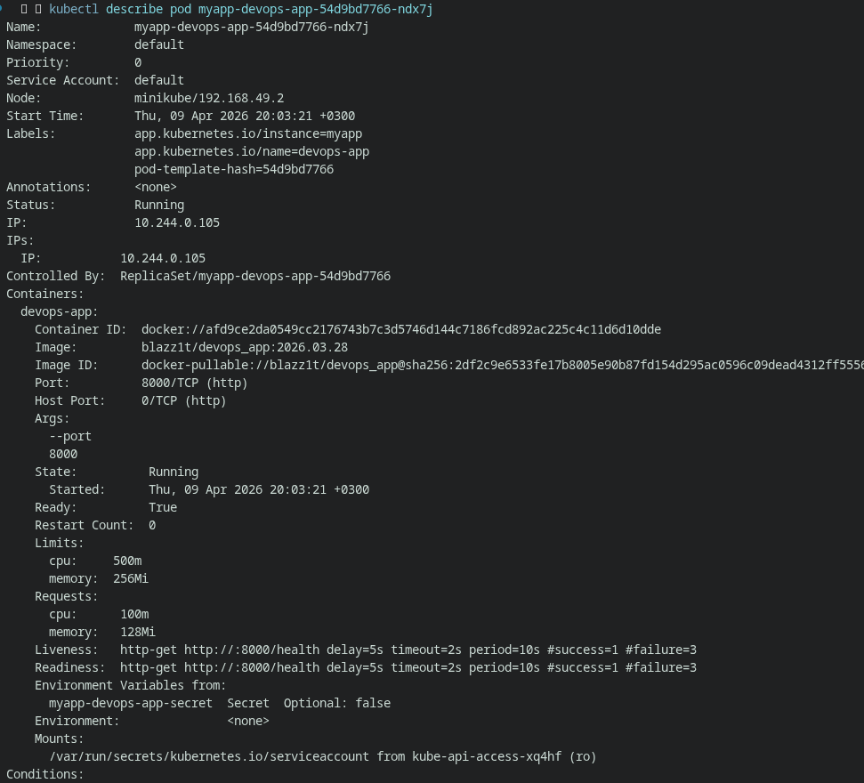
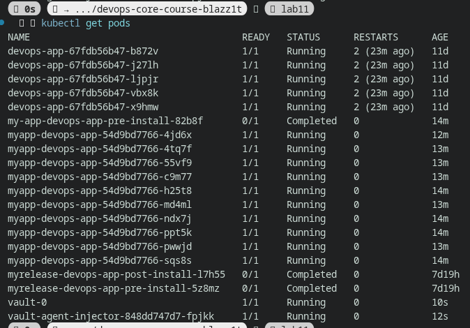
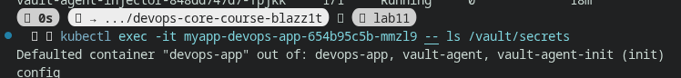

# Lab 11 — Kubernetes Secrets & HashiCorp Vault

## 1. Kubernetes Secrets

### Secret Creation

```bash
kubectl create secret generic app-credentials \
  --from-literal=username=admin \
  --from-literal=password=secret123
```

### Secret YAML



### Decoding Secrets

```bash
echo "YWRtaW4=" | base64 -d
echo "c2VjcmV0MTIz" | base64 -d
```



### Explanation

* Base64 encoding is NOT encryption
* Anyone with access can decode it
* Secrets are stored in etcd

### Security

* Not encrypted at rest by default
* Enable etcd encryption in production
* Use RBAC to restrict access

---

## 2. Helm Secret Integration

### secrets.yaml

```yaml
apiVersion: v1
kind: Secret
...
```

### values.yaml

```yaml
secrets:
  username: placeholder-user
  password: placeholder-pass
```

### Deployment Injection

```yaml
envFrom:
  - secretRef:
      name: devops-app-secret
```

### Verification




---

## 3. Resource Management

```yaml
resources:
  requests:
    memory: "64Mi"
    cpu: "100m"
  limits:
    memory: "128Mi"
    cpu: "200m"
```

### Explanation

* Requests = guaranteed resources
* Limits = maximum allowed
* Prevents noisy neighbor problems

---

## 4. Vault Integration

### Installation

```bash
helm install vault hashicorp/vault ...
```



### Vault Secrets

```bash
vault kv put secret/myapp/config ...
```

### Policy

```hcl
path "secret/data/myapp/config" {
  capabilities = ["read"]
}
```

### Injection

```yaml
vault.hashicorp.com/agent-inject: "true"
```

### Verification




---

## 5. Security Analysis

### Kubernetes Secrets

Pros:

* Simple
* Native

Cons:

* Not encrypted by default
* Weak security model

### Vault

Pros:

* Strong security
* Dynamic secrets
* Fine-grained access

Cons:

* More complex
* Requires setup

### Recommendation

* Dev: Kubernetes Secrets
* Prod: Vault or external manager

---

## 6. Sidecar Pattern

Vault injects a sidecar container that:

* Authenticates with Kubernetes
* Fetches secrets
* Writes them to shared volume

Application reads secrets as files.

---
