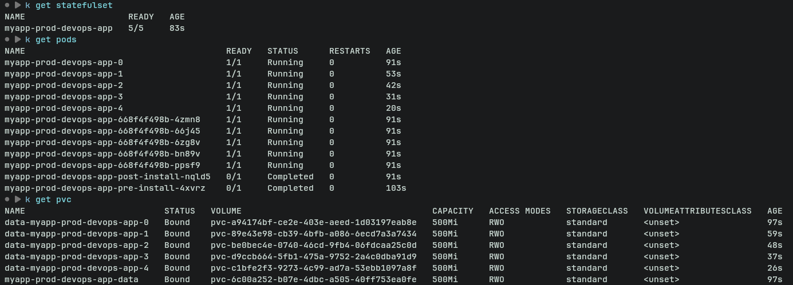
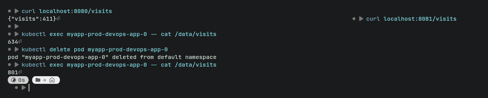

# Lab 15 — StatefulSets & Persistent Storage


## Overview

This lab focused on converting a stateless Kubernetes workload into a stateful one using StatefulSets, Headless Services, and Persistent Volume Claims (PVCs). Unlike Deployments, StatefulSets provide stable pod identities, ordered deployment/scaling behavior, and persistent per-pod storage.

The implementation was based on the existing Helm chart with a visit counter application from previous labs.

---

# Task 1 — StatefulSet Concepts

## Why StatefulSets?

StatefulSets are designed for workloads that require:

- Stable and predictable pod names
- Persistent storage attached to specific pods
- Ordered deployment, scaling, and updates
- Stable network identities

Typical StatefulSet workloads include:

- Databases (PostgreSQL, MySQL, MongoDB)
- Message brokers (Kafka, RabbitMQ)
- Distributed systems (Elasticsearch, Cassandra)

---

## StatefulSet vs Deployment

| Feature | Deployment | StatefulSet |
|---|---|---|
| Pod Naming | Random suffix | Stable ordinal index |
| Storage | Shared/ephemeral | Dedicated PVC per pod |
| Scaling | Parallel | Ordered |
| Network Identity | Dynamic | Stable DNS |
| Typical Use Case | Stateless apps | Stateful apps |

### Deployment Example

Deployment pod names:
```text
myapp-5f7c7d8c6b-abc12
```

### StatefulSet Example

StatefulSet pod names:
```text
myapp-0
myapp-1
myapp-2
```

---

## Headless Services

A headless service is created using:

```yaml
clusterIP: None
```

This allows Kubernetes DNS to expose each pod individually.

Example DNS naming pattern:

```text
<statefulset-pod>.<headless-service>.<namespace>.svc.cluster.local
```

Example:

```text
visits-app-0.visits-app-headless.default.svc.cluster.local
```

This is required for stable networking between StatefulSet pods.

---

# Task 2 — Convert Deployment to StatefulSet

## StatefulSet Template

A new `statefulset.yaml` template was created in the Helm chart.

Key additions:

- `serviceName` pointing to the headless service
- `volumeClaimTemplates`
- Stable pod naming
- Persistent storage per pod

Example structure:

```yaml
apiVersion: apps/v1
kind: StatefulSet
metadata:
  name: visits-app
spec:
  serviceName: visits-app-headless
  replicas: 2

  selector:
    matchLabels:
      app: visits-app

  template:
    metadata:
      labels:
        app: visits-app
    spec:
      containers:
        - name: visits-app
          image: visits-app:latest
          volumeMounts:
            - name: data
              mountPath: /data

  volumeClaimTemplates:
    - metadata:
        name: data
      spec:
        accessModes:
          - ReadWriteOnce
        resources:
          requests:
            storage: 1Gi
```

---

## Headless Service

A dedicated headless service was added:

```yaml
apiVersion: v1
kind: Service
metadata:
  name: visits-app-headless
spec:
  clusterIP: None

  selector:
    app: visits-app

  ports:
    - port: 8000
```

The existing ClusterIP service was kept for external access.

---

## Verification

The following commands were used:

```bash
kubectl get statefulset
kubectl get pods
kubectl get pvc
kubectl get svc
```

### Resource Output

```text
NAME                     READY   AGE
statefulset.apps/visits-app   2/2     5m

NAME              READY   STATUS    RESTARTS   AGE
visits-app-0      1/1     Running   0          5m
visits-app-1      1/1     Running   0          5m

NAME                               STATUS   VOLUME   CAPACITY
data-visits-app-0                  Bound    pvc-1    1Gi
data-visits-app-1                  Bound    pvc-2    1Gi
```

---

## Screenshot — Resources Running



---

# Task 3 — Headless Service & Pod Identity

## DNS Resolution Test

DNS resolution between pods was verified using:

```bash
kubectl exec -it visits-app-0 -- nslookup visits-app-1.visits-app-headless
```

Example result:

```text
Name: visits-app-1.visits-app-headless.default.svc.cluster.local
Address: 10.244.0.15
```

This confirms stable pod networking.

---

## Per-Pod Storage Isolation

Each StatefulSet pod maintains its own visit counter because every pod receives its own Persistent Volume Claim.

Example:

```bash
kubectl port-forward pod/visits-app-0 8080:8000
kubectl port-forward pod/visits-app-1 8081:8000
```

Different visit counts were observed:

```text
Pod visits-app-0 -> Visits: 12
Pod visits-app-1 -> Visits: 3
```

This demonstrates storage isolation.

---

## Persistence Test

The persistence test was performed using:

```bash
kubectl exec visits-app-0 -- cat /data/visits
kubectl delete pod visits-app-0
```

After Kubernetes recreated the pod:

```bash
kubectl exec visits-app-0 -- cat /data/visits
```

The visit count remained unchanged, confirming that the Persistent Volume survived pod deletion.

---

## Screenshot — Persistent Data



---

# Bonus Task — Update Strategies

## RollingUpdate with Partition

Example configuration:

```yaml
updateStrategy:
  type: RollingUpdate
  rollingUpdate:
    partition: 1
```

Behavior:

- Pods with ordinal values greater than or equal to the partition are updated
- Lower ordinal pods remain untouched

Useful for:

- Canary-style updates
- Controlled rollout testing

---

## OnDelete Strategy

Example:

```yaml
updateStrategy:
  type: OnDelete
```

Behavior:

- Pods are only updated after manual deletion
- Kubernetes does not automatically restart pods during updates

Useful for:

- Databases
- Highly sensitive stateful workloads
- Manual maintenance windows

---

# Conclusion

This lab demonstrated how StatefulSets differ from Deployments and how Kubernetes can provide:

- Stable pod identities
- Persistent per-pod storage
- Predictable scaling and update behavior
- Direct pod-to-pod networking using headless services

The StatefulSet successfully preserved application state across pod restarts and ensured isolated storage for every replica.
