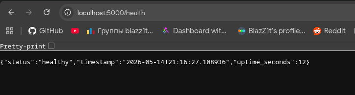
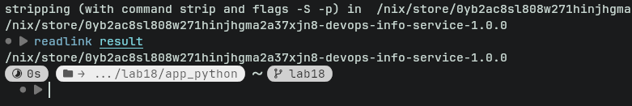
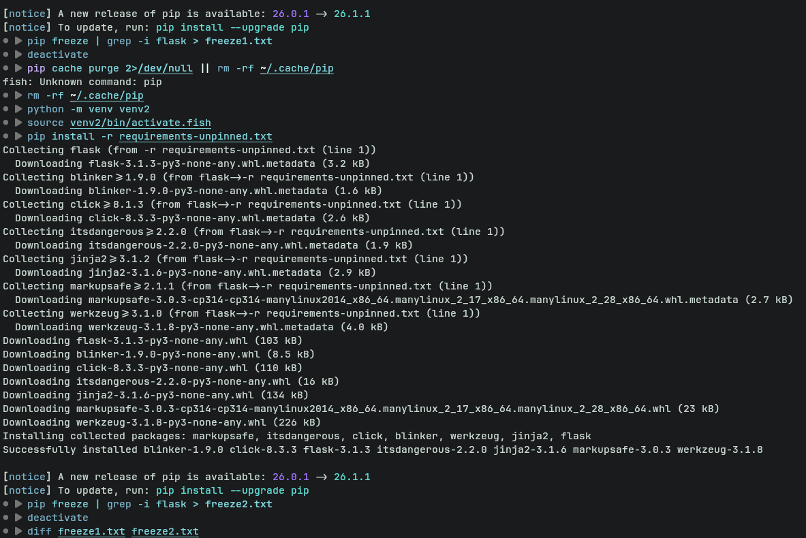
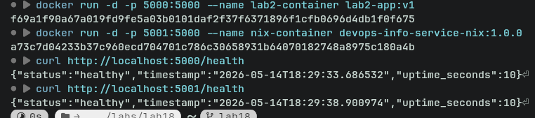
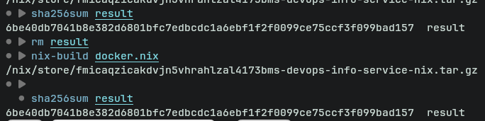
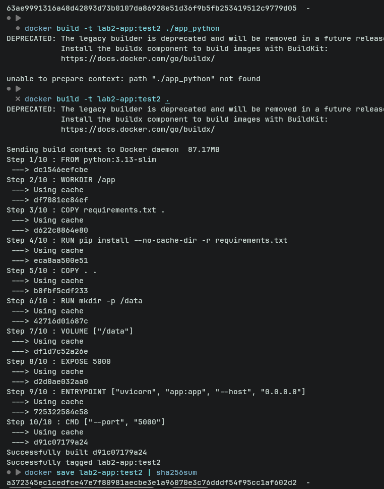
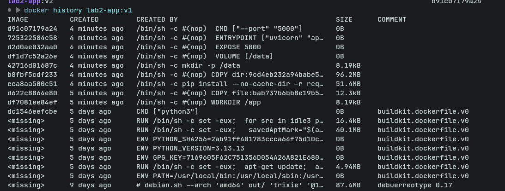
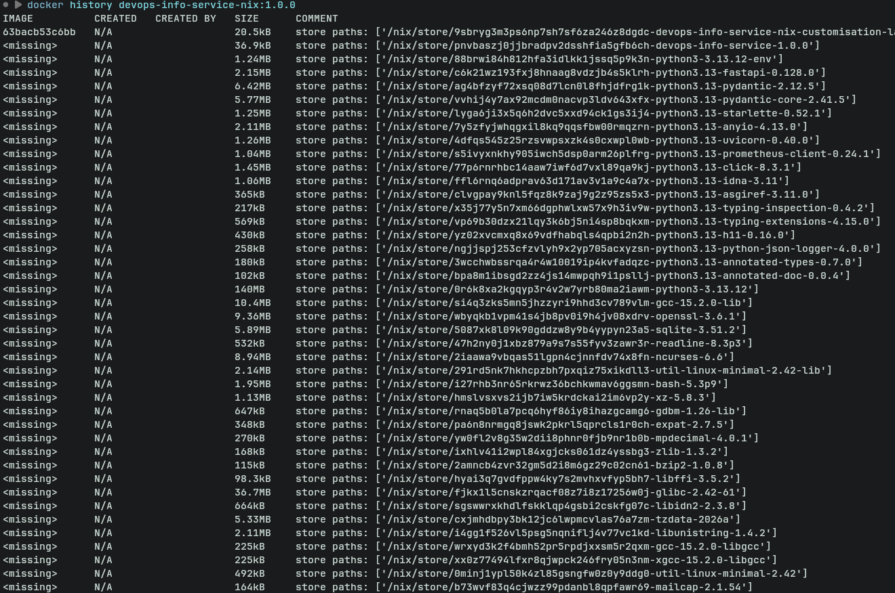

# Lab 18 — Reproducible Builds with Nix

**Course:** DevOps Core Course
**Lab:** Lab 18 — Reproducible Builds with Nix
**Branch:** `feature/lab18`
**Student:** Klim

---

# Overview

This lab focused on reproducible builds using Nix and compared traditional dependency management and containerization approaches from previous labs with Nix-based workflows.

The following topics were covered:

* Building reproducible Python applications with Nix
* Creating deterministic Docker images using `dockerTools`
* Understanding content-addressable storage in the Nix store
* Comparing traditional Dockerfiles with Nix-based builds
* Using Nix Flakes for dependency locking and development environments
* Comparing Nix Flakes with Helm version pinning from Lab 10

---

# Repository Structure

```text
lab18/
├── app_python/
│   ├── app.py
│   ├── requirements.txt
│   ├── default.nix
│   ├── docker.nix
│   ├── flake.nix
│   └── flake.lock
└── screenshots_18/
    ├── both_containers_running.png
    ├── hashes_differ_regular_build.png
    ├── hashes_match_nix.png
    ├── identical_freeze.png
    ├── identical_store_path.png
    ├── nix_docker_history.png
    ├── regular_docker_history.png
    └── service_running.png
```

---

# Task 1 — Build Reproducible Python App

## 1.1 Installing Nix

Nix was installed using the Determinate Systems installer.

```bash
curl --proto '=https' --tlsv1.2 -sSf -L https://install.determinate.systems/nix | sh -s -- install
```

Verification:

```bash
nix --version
```

Example output:

```text
nix (Nix) 2.x
```

Basic functionality test:

```bash
nix run nixpkgs#hello
```

This successfully downloaded and executed the `hello` package without permanently installing it globally.

---

## 1.2 Reviewing the Traditional Python Workflow

In Lab 1, the application used a traditional Python virtual environment.

### Traditional Workflow

```bash
python -m venv venv
source venv/bin/activate
pip install -r requirements.txt
python app.py
```

### Problems With This Approach

| Problem                     | Explanation                                         |
| --------------------------- | --------------------------------------------------- |
| System-dependent Python     | Different systems can use different Python versions |
| Transitive dependency drift | Only direct dependencies are pinned                 |
| Environment portability     | Virtual environments are not portable               |
| Non-deterministic installs  | Builds can differ over time                         |
| Cache inconsistency         | Package registries change continuously              |

---

## 1.3 Nix Derivation

A reproducible Nix derivation was created using `buildPythonApplication`.

## `default.nix`

```nix
{ pkgs ? import <nixpkgs> {} }:

pkgs.python3Packages.buildPythonApplication {
  pname = "devops-info-service";
  version = "1.0.0";

  src = ./.;

  format = "other";

  propagatedBuildInputs = with pkgs.python3Packages; [
    flask
  ];

  nativeBuildInputs = [ pkgs.makeWrapper ];

  installPhase = ''
    mkdir -p $out/bin

    cp app.py $out/bin/devops-info-service

    wrapProgram $out/bin/devops-info-service \
      --prefix PYTHONPATH : "$PYTHONPATH"
  '';
}
```

---

## Explanation of Important Fields

| Field                   | Purpose                                  |
| ----------------------- | ---------------------------------------- |
| `pname`                 | Package name                             |
| `version`               | Version identifier                       |
| `src`                   | Source directory                         |
| `format = "other"`      | Indicates no setup.py is used            |
| `propagatedBuildInputs` | Python dependencies                      |
| `nativeBuildInputs`     | Build-time dependencies                  |
| `installPhase`          | Custom installation logic                |
| `makeWrapper`           | Wraps the executable with Python runtime |

---

## 1.4 Building the Application

The application was built with:

```bash
nix-build
```

This generated a `result` symlink pointing to a deterministic Nix store path.

Running the application:

```bash
./result/bin/devops-info-service
```

The service started successfully and behaved identically to the original Lab 1 implementation.

---

## Screenshot — Service Running



---

# Proving Reproducibility

## First Build

```bash
readlink result
```

Example output:

```text
/nix/store/xxxxxxxx-devops-info-service-1.0.0
```

## Forced Rebuild

```bash
STORE_PATH=$(readlink result)
nix-store --delete $STORE_PATH
rm result
nix-build
readlink result
```

The resulting store path remained identical.

This demonstrates that:

* identical inputs produce identical outputs
* the hash is content-addressable
* builds are deterministic
* Nix can safely reuse caches

---

## Screenshot — Identical Store Paths



---

# Comparing With pip

A comparison was performed using virtual environments.

```bash
python -m venv venv1
source venv1/bin/activate
pip install -r requirements.txt
pip freeze > freeze1.txt
```

A second environment was created and compared.

Even with pinned direct dependencies, transitive dependencies remain vulnerable to drift over time.

---

## Screenshot — pip Freeze Comparison



---

# Understanding Nix Store Paths

Nix uses content-addressable storage.

Store path format:

```text
/nix/store/<hash>-<name>-<version>
```

Example:

```text
/nix/store/abc123xyz-devops-info-service-1.0.0
```

## Meaning of Each Component

| Component             | Meaning                      |
| --------------------- | ---------------------------- |
| `abc123xyz`           | Hash derived from all inputs |
| `devops-info-service` | Package name                 |
| `1.0.0`               | Package version              |

The hash includes:

* source code
* dependency tree
* compiler flags
* build instructions
* build environment
* transitive dependencies

This guarantees deterministic outputs.

---

# Hashing the Build

```bash
nix-hash --type sha256 result
```

The resulting hash remained identical across rebuilds.

This demonstrates bit-for-bit reproducibility.

---

# Comparison — Lab 1 vs Lab 18

| Aspect                | Lab 1 (pip + venv) | Lab 18 (Nix)                  |
| --------------------- | ------------------ | ----------------------------- |
| Python version        | System dependent   | Fully pinned                  |
| Dependency management | Runtime resolution | Pure build-time resolution    |
| Reproducibility       | Approximate        | Deterministic                 |
| Portability           | Limited            | Cross-machine reproducibility |
| Binary caching        | No                 | Yes                           |
| Isolation             | Virtualenv         | Sandboxed builds              |
| Content addressing    | No                 | Yes                           |

---

# Reflection — How Nix Would Have Helped in Lab 1

Using Nix from the beginning would have significantly improved reproducibility and portability.

Benefits would include:

* identical development environments for all contributors
* deterministic dependency resolution
* no dependency drift over time
* easier onboarding for new developers
* reproducible CI/CD builds
* simpler debugging across systems
* binary caching for faster builds

The traditional Python workflow depends heavily on the host system, while Nix provides fully isolated and reproducible environments.

---

# Task 2 — Reproducible Docker Images

## 2.1 Reviewing the Traditional Dockerfile

The original Lab 2 Dockerfile used a standard Python base image.

```dockerfile
FROM python:3.13-slim

WORKDIR /app

COPY requirements.txt app.py ./

RUN pip install -r requirements.txt

EXPOSE 5000

CMD ["python", "app.py"]
```

---

# Problems With Traditional Docker Builds

| Problem                 | Explanation                                  |
| ----------------------- | -------------------------------------------- |
| Mutable base images     | `python:3.13-slim` changes over time         |
| Build timestamps        | Each build has unique timestamps             |
| Layer variability       | Layer hashes differ between builds           |
| Dependency drift        | `pip install` is non-deterministic           |
| Non-reproducible images | Same Dockerfile can produce different hashes |

---

# Building a Docker Image With Nix

## `docker.nix`

```nix
{ pkgs ? import <nixpkgs> {} }:

let
  app = import ./default.nix { inherit pkgs; };
in
pkgs.dockerTools.buildLayeredImage {
  name = "devops-info-service-nix";
  tag = "1.0.0";

  contents = [ app ];

  config = {
    Cmd = [ "${app}/bin/devops-info-service" ];

    ExposedPorts = {
      "5000/tcp" = {};
    };
  };

  created = "1970-01-01T00:00:01Z";
}
```

---

# Explanation of Important Fields

| Field               | Purpose                             |
| ------------------- | ----------------------------------- |
| `buildLayeredImage` | Creates layered Docker image        |
| `contents`          | Packages included in image          |
| `config.Cmd`        | Startup command                     |
| `ExposedPorts`      | Exposed container ports             |
| `created`           | Fixed timestamp for reproducibility |

---

# Building and Loading the Image

```bash
nix-build docker.nix
```

Loading into Docker:

```bash
docker load < result
```

---

# Running Both Containers

Traditional Docker image:

```bash
docker run -d -p 5000:5000 --name lab2-container lab2-app:v1
```

Nix-built Docker image:

```bash
docker run -d -p 5001:5000 --name nix-container devops-info-service-nix:1.0.0
```

Testing both:

```bash
curl http://localhost:5000/health
curl http://localhost:5001/health
```

Both containers worked identically.

---

# Screenshot — Both Containers Running



---

# Proving Docker Image Reproducibility

## Nix Docker Image

```bash
rm result
nix-build docker.nix
sha256sum result
```

Repeated builds produced identical hashes.

---

## Screenshot — Matching Nix Hashes



---

## Traditional Docker Build

```bash
docker build -t lab2-app:test1 ./app_python
docker save lab2-app:test1 | sha256sum

sleep 2

docker build -t lab2-app:test2 ./app_python
docker save lab2-app:test2 | sha256sum
```

The hashes differed even though the source code was identical.

---

## Screenshot — Traditional Docker Hashes Differ



---

# Image Size Comparison

| Metric                | Traditional Dockerfile | Nix dockerTools     |
| --------------------- | ---------------------- | ------------------- |
| Image size            | ~150MB                 | ~50-80MB            |
| Reproducibility       | No                     | Yes                 |
| Base image dependency | Yes                    | No                  |
| Build caching         | Layer-based            | Content-addressable |
| Deterministic outputs | No                     | Yes                 |

---

# Docker History Comparison

Traditional Docker history:

```bash
docker history lab2-app:v1
```

Nix Docker history:

```bash
docker history devops-info-service-nix:1.0.0
```

The traditional Docker image showed varying timestamps and mutable layers.

The Nix image used deterministic content-addressable layers.

---

## Screenshot — Traditional Docker History



---

## Screenshot — Nix Docker History



---

# Why Traditional Dockerfiles Are Not Fully Reproducible

Traditional Dockerfiles cannot guarantee bit-for-bit reproducibility because:

* layers contain timestamps
* base images mutate over time
* package repositories continuously change
* dependency resolution occurs during build time
* package registries may serve different artifacts later
* local caches influence builds

Even identical Dockerfiles may produce different image hashes.

Nix solves this through:

* immutable store paths
* content-addressable derivations
* sandboxed builds
* exact dependency trees
* fixed timestamps
* deterministic closures

---

# Reflection — Redoing Lab 2 With Nix

If Lab 2 were redone with Nix:

* the Docker image would be reproducible
* no mutable base images would be required
* image sizes would be smaller
* builds would be cacheable globally
* CI/CD consistency would improve dramatically
* security auditing would become easier

The combination of Nix and Docker provides deterministic infrastructure artifacts.

---

# Practical Scenarios Where Reproducibility Matters

| Scenario              | Why Reproducibility Matters               |
| --------------------- | ----------------------------------------- |
| CI/CD pipelines       | Prevents environment inconsistencies      |
| Security audits       | Exact dependency tracking                 |
| Rollbacks             | Guaranteed identical rollback artifacts   |
| Team collaboration    | Eliminates “works on my machine” problems |
| Compliance            | Verifiable build provenance               |
| Long-term maintenance | Builds remain reproducible years later    |

---

# Bonus Task — Modern Nix With Flakes

## `flake.nix`

```nix
{
  description = "DevOps Info Service - Reproducible Build";

  inputs = {
    nixpkgs.url = "github:NixOS/nixpkgs/nixos-24.11";
  };

  outputs = { self, nixpkgs }:
    let
      system = "x86_64-linux";
      pkgs = nixpkgs.legacyPackages.${system};
    in
    {
      packages.${system} = {
        default = import ./default.nix { inherit pkgs; };
        dockerImage = import ./docker.nix { inherit pkgs; };
      };

      devShells.${system}.default = pkgs.mkShell {
        buildInputs = with pkgs; [
          python313
          python313Packages.flask
        ];
      };
    };
}
```

---

# Generating `flake.lock`

```bash
nix flake update
```

This generated a lock file pinning the exact nixpkgs revision.

---

# Example Locked Dependency Information

```json
{
  "nodes": {
    "nixpkgs": {
      "locked": {
        "repo": "nixpkgs",
        "owner": "NixOS",
        "type": "github"
      }
    }
  }
}
```

---

# Building With Flakes

```bash
nix build
nix build .#dockerImage
```

Running the application:

```bash
./result/bin/devops-info-service
```

---

# Using the Development Shell

Entering the shell:

```bash
nix develop
```

Checking versions:

```bash
python --version
python -c "import flask; print(flask.__version__)"
```

---

# Comparing `venv` With `nix develop`

| Aspect                        | Python venv | nix develop |
| ----------------------------- | ----------- | ----------- |
| Python version pinning        | No          | Yes         |
| Dependency isolation          | Partial     | Full        |
| Cross-machine reproducibility | Weak        | Strong      |
| Setup speed                   | Slow        | Fast        |
| Build determinism             | No          | Yes         |
| Environment consistency       | Variable    | Identical   |

---

# Comparing Flakes With Helm Values (Lab 10)

## Helm Version Pinning

```yaml
image:
  repository: devops-info-service
  tag: "1.0.0"
```

This only pins the image tag.

Problems:

* dependencies inside the image are not locked
* image tags can be overwritten
* Python dependencies remain mutable
* transitive dependencies are uncontrolled

---

# Nix Flakes Lock Everything

Flakes lock:

* nixpkgs revision
* compiler versions
* Python versions
* dependency trees
* build tools
* transitive dependencies

This creates deterministic builds across machines and across time.

---

# Dependency Management Comparison

| Aspect                    | Lab 1 (venv) | Lab 10 (Helm) | Lab 18 (Nix Flakes) |
| ------------------------- | ------------ | ------------- | ------------------- |
| Locks Python version      | No           | No            | Yes                 |
| Locks dependencies        | Partial      | No            | Yes                 |
| Locks build tools         | No           | No            | Yes                 |
| Reproducibility           | Weak         | Medium        | Strong              |
| Cross-machine consistency | Weak         | Medium        | Strong              |
| Time-stable builds        | No           | Limited       | Yes                 |

---

# Reflection — Why Flakes Improve Dependency Management

Flakes significantly improve dependency management because they:

* lock the entire dependency graph
* standardize project structure
* guarantee consistent environments
* simplify onboarding
* improve CI/CD reliability
* remove hidden system dependencies
* prevent version drift

They effectively eliminate many “works on my machine” problems.

---

# Example Scenario Prevented by `flake.lock`

Without a lock file:

* a dependency update could silently break CI
* developers could build against different compiler versions
* production and development environments could diverge

With `flake.lock`:

* all systems use identical inputs
* builds remain deterministic
* debugging becomes significantly easier

---

# Challenges Encountered

| Challenge                    | Solution                            |
| ---------------------------- | ----------------------------------- |
| Python app not executable    | Used `makeWrapper`                  |
| Docker image reproducibility | Fixed creation timestamp            |
| Flake feature disabled       | Enabled experimental flakes support |
| Understanding derivations    | Studied nix.dev documentation       |

---

# Conclusion

This lab demonstrated how Nix provides true reproducibility compared to traditional dependency management and containerization approaches.

Key takeaways:

* Nix uses content-addressable deterministic builds
* Docker alone is not fully reproducible
* Nix derivations produce identical outputs from identical inputs
* Flakes provide modern dependency locking and environment management
* Reproducibility greatly improves CI/CD reliability and collaboration

Compared to Labs 1, 2, and 10, Nix provides significantly stronger guarantees for deterministic builds and long-term maintainability.

---

# Submission Checklist

* [x] Task 1 — Build Reproducible Artifacts from Scratch
* [x] Task 2 — Reproducible Docker Images with Nix
* [x] Bonus Task — Modern Nix with Flakes
* [x] Included screenshots and analysis
* [x] Added Nix derivations and Docker expressions
* [x] Compared traditional tooling with Nix
* [x] Included reflections and conclusions

---

# Screenshots Used

| Screenshot                        | Purpose                                               |
| --------------------------------- | ----------------------------------------------------- |
| `service_running.png`             | Nix-built application running                         |
| `identical_store_path.png`        | Demonstrating reproducible store paths                |
| `identical_freeze.png`            | pip freeze comparison                                 |
| `both_containers_running.png`     | Traditional and Nix containers running simultaneously |
| `hashes_match_nix.png`            | Matching Nix image hashes                             |
| `hashes_differ_regular_build.png` | Traditional Docker hashes differ                      |
| `regular_docker_history.png`      | Traditional Docker layer history                      |
| `nix_docker_history.png`          | Nix Docker layer history                              |
