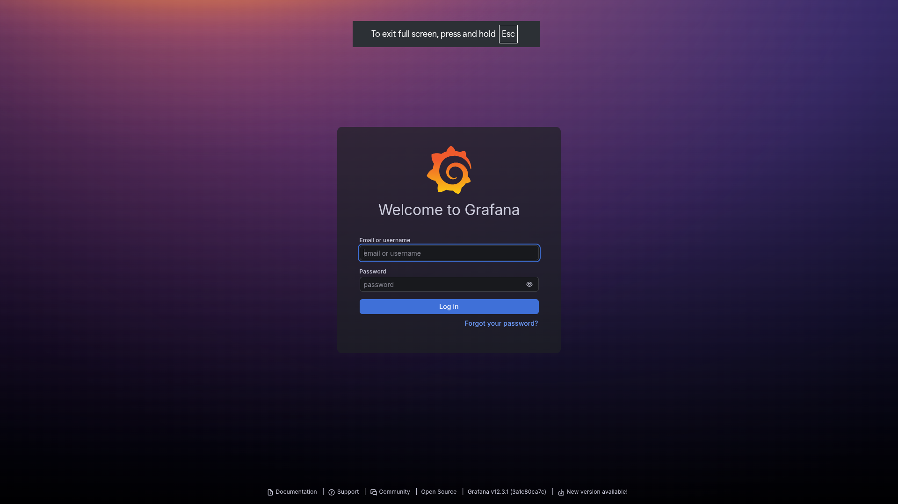
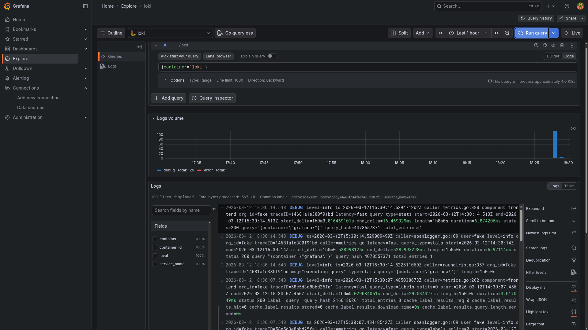
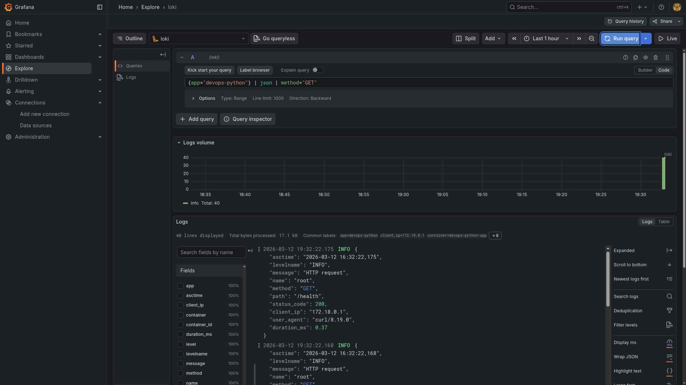
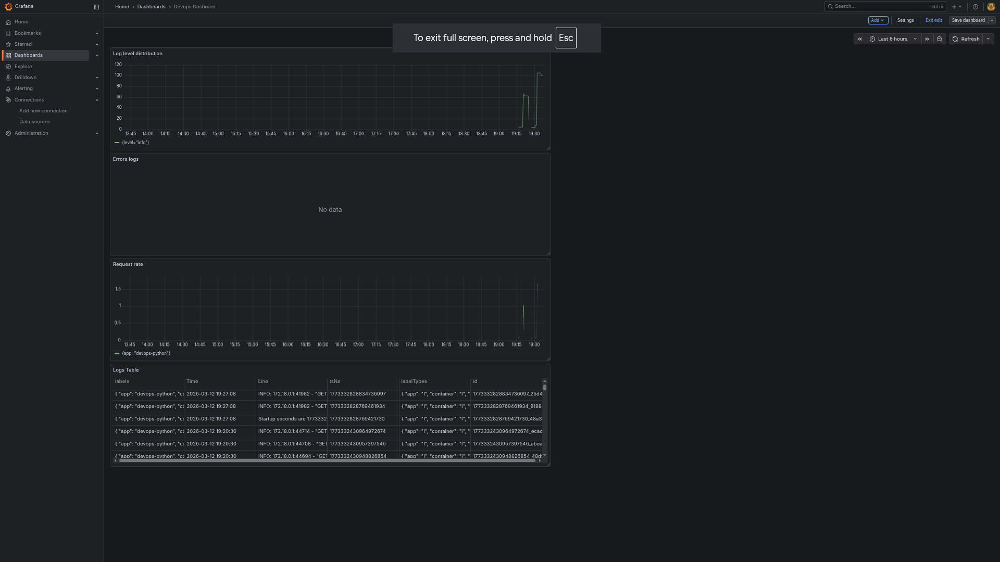
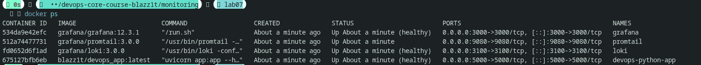
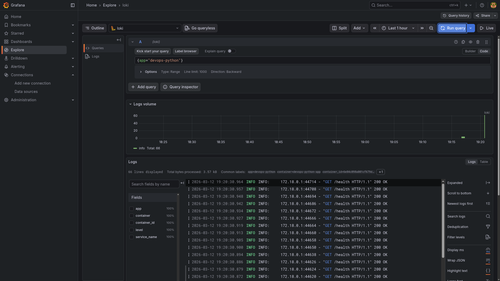
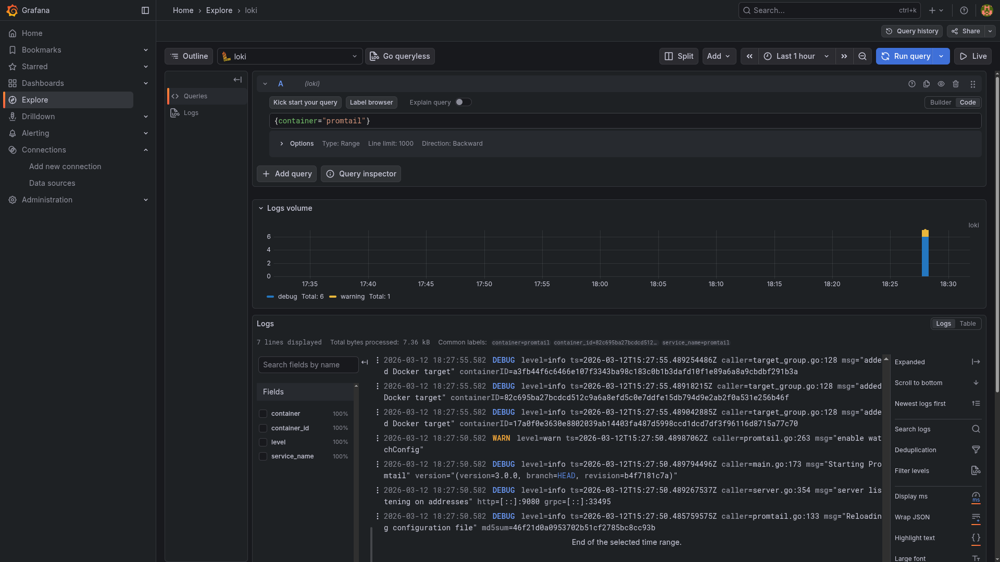
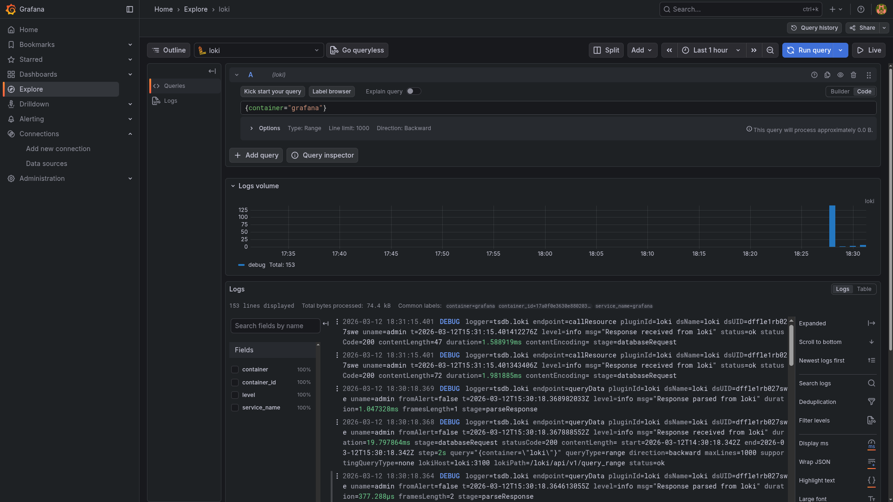
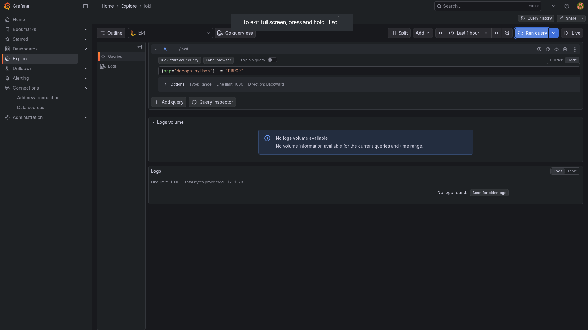

# Lab 07 --- Centralized Logging with Loki, Promtail, and Grafana

## Architecture

The system implements centralized logging using **Grafana Loki**,
**Promtail**, and **Grafana** alongside a Python FastAPI application.

**Components:**

-   **Python Application** --- Generates structured JSON logs.
-   **Promtail** --- Discovers Docker containers and ships logs to Loki.
-   **Loki** --- Stores and indexes logs.
-   **Grafana** --- Visualizes logs using LogQL queries.

**Flow:**

1.  Application writes logs to **stdout** in JSON format.
2.  Docker stores logs in container log streams.
3.  **Promtail** discovers containers via Docker API and reads logs.
4.  Promtail pushes logs to **Loki**.
5.  **Grafana** queries Loki and displays logs on dashboards.

**Diagram (conceptual):**

    +-------------------+
    |   Python App      |
    |  (JSON logging)   |
    +--------+----------+
             |
             v
    +-------------------+
    |   Docker Logs     |
    +--------+----------+
             |
             v
    +-------------------+
    |     Promtail      |
    |  Docker Discovery |
    +--------+----------+
             |
             v
    +-------------------+
    |       Loki        |
    |  Log Storage      |
    +--------+----------+
             |
             v
    +-------------------+
    |      Grafana      |
    |  Dashboards & UI  |
    +-------------------+

------------------------------------------------------------------------

# Setup Guide

## 1. Clone repository

``` bash
git clone <repository>
cd monitoring
```

## 2. Start monitoring stack

``` bash
docker compose up -d
```

## 3. Verify containers

``` bash
docker ps
```

Expected containers:

-   loki
-   promtail
-   grafana
-   devops-python-app

## 4. Access Grafana

Open:

    http://localhost:3000

Login page screenshot:



## 5. Add Loki datasource

Navigate:

    Connections → Data Sources → Loki

Set URL:

    http://loki:3100

Screenshot:



------------------------------------------------------------------------

# Configuration

## Promtail Configuration

Promtail automatically discovers Docker containers and collects logs.

Key configuration snippet:

``` yaml
scrape_configs:
  - job_name: docker
    docker_sd_configs:
      - host: unix:///var/run/docker.sock
        refresh_interval: 5s
        filters:
          - name: label
            values: ["logging=promtail"]
```

**Explanation**

-   Uses **Docker service discovery**
-   Only collects logs from containers labeled:

```{=html}
<!-- -->
```
    logging=promtail

This prevents collecting logs from unrelated containers.

### Relabeling

``` yaml
relabel_configs:
  - source_labels: ['__meta_docker_container_name']
    regex: '/(.*)'
    target_label: container

  - source_labels: ['__meta_docker_container_label_app']
    target_label: app
```

Purpose:

-   Extract container metadata
-   Create labels used in **LogQL queries**

Resulting labels:

    container
    image
    container_id
    app

------------------------------------------------------------------------

# Loki Configuration

Loki stores logs using filesystem storage.

Configuration snippet:

``` yaml
limits_config:
  retention_period: 168h
```

Logs are retained for:

    7 days

### Storage backend

    filesystem

This is suitable for **development environments**.

### Compactor

``` yaml
compactor:
  retention_enabled: true
```

Responsible for:

-   deleting expired logs
-   compacting log chunks

------------------------------------------------------------------------

# Application Logging

The Python application implements **structured JSON logging** using:

    python-json-logger

### Logger configuration

``` python
logger = logging.getLogger()
logger.setLevel(logging.INFO)

handler = logging.StreamHandler()
formatter = jsonlogger.JsonFormatter(
    "%(asctime)s %(levelname)s %(message)s %(name)s"
)
handler.setFormatter(formatter)
logger.addHandler(handler)
```

### Example log output

``` json
{
  "asctime": "2026-03-12 16:47:27",
  "levelname": "INFO",
  "message": "HTTP request",
  "method": "GET",
  "path": "/health",
  "status_code": 200
}
```

Benefits of JSON logging:

-   machine-readable format
-   easy parsing in Loki
-   structured LogQL queries

### Logged events

The application logs:

-   application startup
-   HTTP requests
-   request metadata
-   exceptions

Example request log:



------------------------------------------------------------------------

# Dashboard

Example dashboard panels:



### Panel 1 --- All Logs

Query:

    {app="devops-python"}

Displays all logs from the Python application.

### Panel 2 --- HTTP Requests

Query:

    {app="devops-python"} | json | method="GET"

Filters logs to show only GET requests.

### Panel 3 --- Error Logs

Query:

    {app="devops-python"} | json | levelname="ERROR"

Shows only error-level logs.

### Panel 4 --- Request Duration

Query:

    {app="devops-python"} | json | unwrap duration_ms

Extracts request latency.

------------------------------------------------------------------------

# Production Configuration

Several production practices were applied.

### Resource limits

Each container includes CPU and memory constraints.

Example:

``` yaml
deploy:
  resources:
    limits:
      cpus: '1.0'
      memory: 1G
```

Benefits:

-   prevents resource exhaustion
-   protects host stability

### Retention policy

Loki retains logs for:

    168 hours (7 days)

### Container health checks

Example:

``` yaml
healthcheck:
  test: ["CMD", "python", "-c", "import urllib.request; urllib.request.urlopen('http://localhost:5000/health')"]
```

This ensures containers remain healthy.

Healthcheck screenshot:



------------------------------------------------------------------------

# Testing

## Verify containers

``` bash
docker ps
```

Expected status:

    healthy

## Generate application logs

``` bash
curl http://localhost:5000
curl http://localhost:5000/health
```

## Verify logs inside container

``` bash
docker logs devops-python-app
```

Screenshot:



## Query logs in Grafana

Example LogQL:

    {app="devops-python"} | json

Result screenshot:



------------------------------------------------------------------------

# Challenges

## 1. Promtail not collecting logs

**Problem**

Promtail initially collected logs from all containers.

**Solution**

Added label filtering:

    logging=promtail

------------------------------------------------------------------------

## 2. Application logs missing

**Problem**

Promtail only collects logs from stdout.

**Solution**

Configured Python logging to output JSON logs to stdout using:

    StreamHandler()

------------------------------------------------------------------------

## 3. Health check failures

**Problem**

Health checks failed due to missing tools like `wget` in the container.

**Solution**

Used Python-based health check:

``` yaml
python -c "import urllib.request"
```

------------------------------------------------------------------------

# Evidence of Completed Tasks

### Grafana running



### Loki datasource


### Promtail logs


### Application logs without errors



------------------------------------------------------------------------

# Conclusion

This lab successfully implemented a centralized logging stack using:

-   Loki
-   Promtail
-   Grafana
-   Structured JSON logging

The system enables efficient log aggregation, querying, and
visualization, which are essential practices for modern **DevOps
observability pipelines**.
