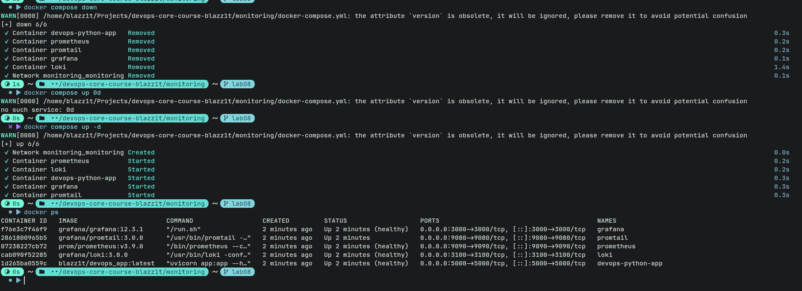
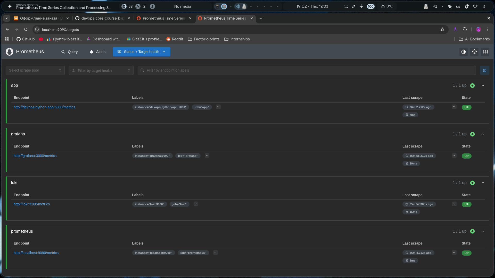
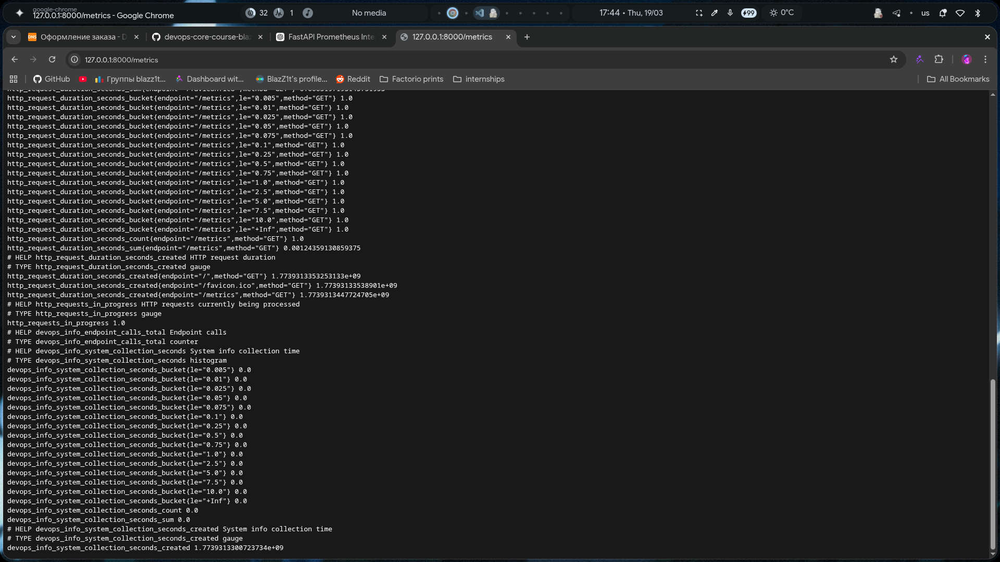
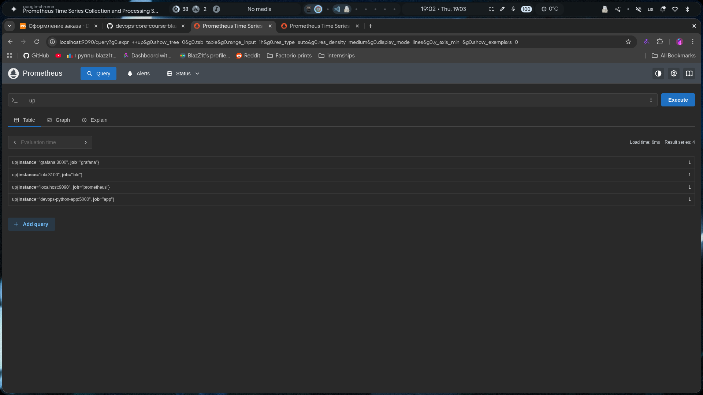
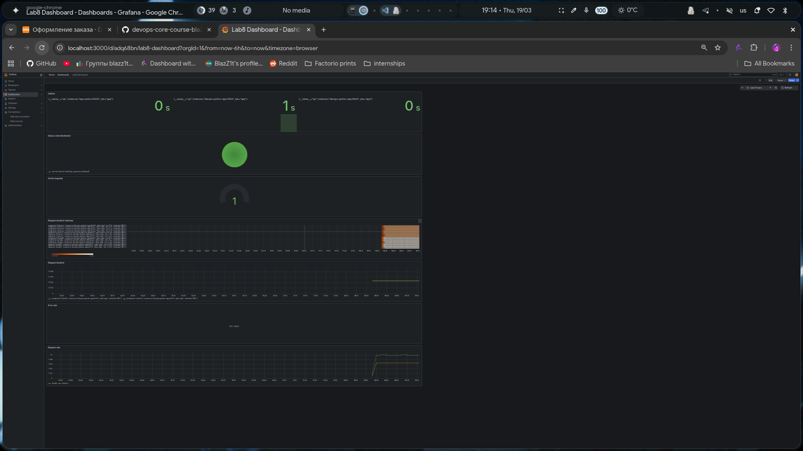
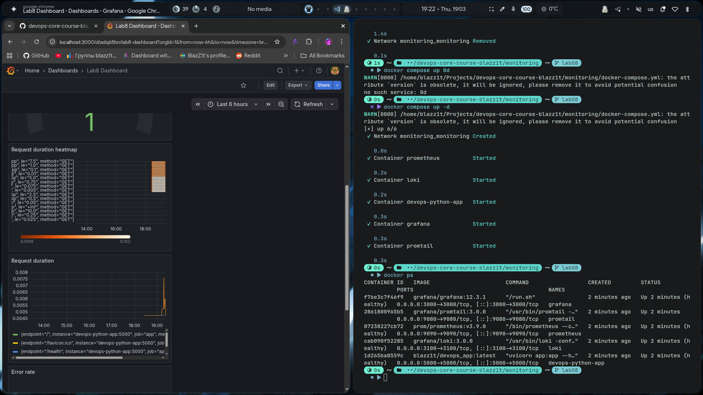

# Lab 08 --- Metrics Monitoring with Prometheus & Grafana

## Architecture

This lab extends the logging stack by adding **metrics monitoring**
using Prometheus.

**Flow:**

    FastAPI App → Prometheus → Grafana

-   FastAPI exposes `/metrics`
-   Prometheus scrapes metrics every 15s
-   Grafana visualizes metrics

------------------------------------------------------------------------

## Application Instrumentation

### HTTP Metrics

-   `http_requests_total` --- request count (RED: Rate)
-   `http_request_duration_seconds` --- latency (RED: Duration)
-   `http_requests_in_progress` --- active requests

Labels used: - method - endpoint (normalized) - status_code

### Business Metrics

-   `devops_info_endpoint_calls` --- endpoint usage
-   `devops_info_system_collection_seconds` --- system info time

**Why:** - Enables RED method monitoring - Tracks performance and load

------------------------------------------------------------------------

## Prometheus Configuration

-   Scrape interval: 15s
-   Retention: 15d / 10GB

Targets: - Prometheus: localhost:9090 - App: devops-python-app:5000 -
Loki: loki:3100 - Grafana: grafana:3000

------------------------------------------------------------------------

## Dashboard Walkthrough

### Panels

1.  **Request Rate**

```{=html}
<!-- -->
```
    rate(http_requests_total[1m])

2.  **Error Rate**

```{=html}
<!-- -->
```
    rate(http_requests_total{status_code!~"2.."}[1m])

3.  **Latency (p95)**

```{=html}
<!-- -->
```
    histogram_quantile(0.95, rate(http_request_duration_seconds_bucket[5m]))

4.  **Active Requests**

```{=html}
<!-- -->
```
    http_requests_in_progress

5.  **Endpoint Usage**

```{=html}
<!-- -->
```
    devops_info_endpoint_calls

------------------------------------------------------------------------

## PromQL Examples

1.  Request rate:

```{=html}
<!-- -->
```
    rate(http_requests_total[1m])

2.  Error rate:

```{=html}
<!-- -->
```
    rate(http_requests_total{status_code!~"2.."}[1m])

3.  Latency p95:

```{=html}
<!-- -->
```
    histogram_quantile(0.95, rate(http_request_duration_seconds_bucket[5m]))

4.  Requests by endpoint:

```{=html}
<!-- -->
```
    sum by (endpoint) (http_requests_total)

5.  Active requests:

```{=html}
<!-- -->
```
    http_requests_in_progress

------------------------------------------------------------------------

## Production Setup

-   Health checks for all services
-   Resource limits (CPU/memory)
-   Retention:
    -   Prometheus: 15 days
    -   Loki: 7 days

------------------------------------------------------------------------

## Testing Results

### Services healthy



### Prometheus targets



### Metrics endpoint



### PromQL queries



### Grafana dashboard



### Dashboard persistence



------------------------------------------------------------------------

## Challenges & Solutions

### 1. Metrics not visible

-   Fixed by adding `/metrics` endpoint

### 2. High cardinality

-   Solved by normalizing endpoints

### 3. Wrong service names

-   Fixed using Docker service DNS

------------------------------------------------------------------------

## Comparison: Metrics vs Logs

  Metrics             Logs
  ------------------- --------------------
  Aggregated          Detailed
  Fast queries        Rich context
  Good for alerting   Good for debugging

Use: - Metrics → monitoring & alerts - Logs → root cause analysis

------------------------------------------------------------------------

## Evidence

-   Dashboards with live data
-   PromQL queries (RED method)
-   Healthy services
