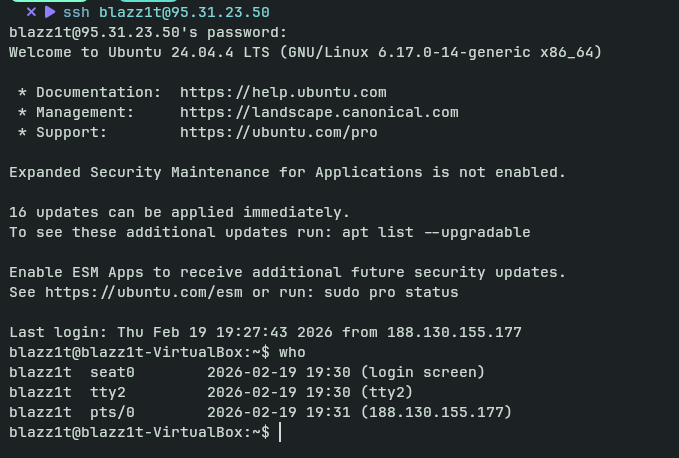
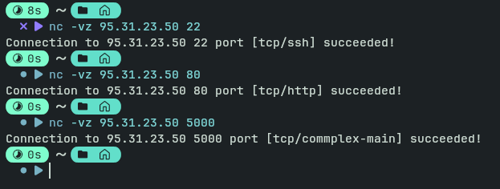

## Cloud Provider and infrastracture
For the completion of the task local homelab vm was setup, after the incident with VK cloud. The setup is the following:

1. Remote router, set up to forward connections on ports 8443, 80, 5000 and 22
2. Windows machine, set up to forward all the connections to the virtual machine inside of it
3. Ubuntu 24.04 VM, ran with Virtual box, that accepts connections on ports 22, 80 and 5000.

For the sake of not blocking other ports, the ports are changed between the router and the final VM, so while going through the windows machine ports may change to 2222, 8080, etc.

Total cost: 1000 rubles (stolen by VK cloud)

Screenshot of VM terminal being accessed via ssh

Since local VM was setup and cloud providers failed me I have not done a setup using terraform or pulumi.

### VM for lab5
I am keeping my cloud/local VM up till lab5.
The VM is acessible on my personal homelab IP address.

Here's a proof of it still running:
